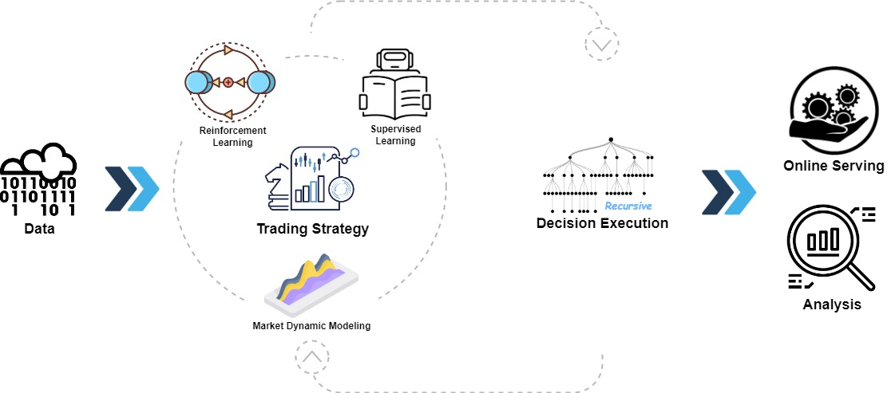

[](https://pypi.org/project/pyqlib/#files)
[](https://pypi.org/project/pyqlib/#files)
[](https://pypi.org/project/pyqlib/#history)
[](https://pypi.org/project/pyqlib/)
[](https://github.com/microsoft/qlib/actions)
[](https://qlib.readthedocs.io/en/latest/?badge=latest)
[](LICENSE)
[](https://gitter.im/Microsoft/qlib?utm_source=badge&utm_medium=badge&utm_campaign=pr-badge&utm_content=badge)

## :newspaper: **What's NEW!** &nbsp;   :sparkling_heart: 
Recent released features
| Feature | Status |
| --                      | ------    |
| KRNN and Sandwich models | :chart_with_upwards_trend: [Released](https://github.com/microsoft/qlib/pull/1414/) on May 26, 2023 |
| Release Qlib v0.9.0 | :octocat: [Released](https://github.com/microsoft/qlib/releases/tag/v0.9.0) on Dec 9, 2022 |
| RL Learning Framework | :hammer: :chart_with_upwards_trend: Released on Nov 10, 2022. [#1332](https://github.com/microsoft/qlib/pull/1332), [#1322](https://github.com/microsoft/qlib/pull/1322), [#1316](https://github.com/microsoft/qlib/pull/1316),[#1299](https://github.com/microsoft/qlib/pull/1299),[#1263](https://github.com/microsoft/qlib/pull/1263), [#1244](https://github.com/microsoft/qlib/pull/1244), [#1169](https://github.com/microsoft/qlib/pull/1169), [#1125](https://github.com/microsoft/qlib/pull/1125), [#1076](https://github.com/microsoft/qlib/pull/1076)|
| HIST and IGMTF models | :chart_with_upwards_trend: [Released](https://github.com/microsoft/qlib/pull/1040) on Apr 10, 2022 |
| Qlib [notebook tutorial](https://github.com/microsoft/qlib/tree/main/examples/tutorial) | 📖 [Released](https://github.com/microsoft/qlib/pull/1037) on Apr 7, 2022 | 
| Ibovespa index data | :rice: [Released](https://github.com/microsoft/qlib/pull/990) on Apr 6, 2022 |
| Point-in-Time database | :hammer: [Released](https://github.com/microsoft/qlib/pull/343) on Mar 10, 2022 |
| Arctic Provider Backend & Orderbook data example | :hammer: [Released](https://github.com/microsoft/qlib/pull/744) on Jan 17, 2022 |
| Meta-Learning-based framework & DDG-DA  | :chart_with_upwards_trend:  :hammer: [Released](https://github.com/microsoft/qlib/pull/743) on Jan 10, 2022 | 
| Planning-based portfolio optimization | :hammer: [Released](https://github.com/microsoft/qlib/pull/754) on Dec 28, 2021 | 
| Release Qlib v0.8.0 | :octocat: [Released](https://github.com/microsoft/qlib/releases/tag/v0.8.0) on Dec 8, 2021 |
| ADD model | :chart_with_upwards_trend: [Released](https://github.com/microsoft/qlib/pull/704) on Nov 22, 2021 |
| ADARNN  model | :chart_with_upwards_trend: [Released](https://github.com/microsoft/qlib/pull/689) on Nov 14, 2021 |
| TCN  model | :chart_with_upwards_trend: [Released](https://github.com/microsoft/qlib/pull/668) on Nov 4, 2021 |
| Nested Decision Framework | :hammer: [Released](https://github.com/microsoft/qlib/pull/438) on Oct 1, 2021. [Example](https://github.com/microsoft/qlib/blob/main/examples/nested_decision_execution/workflow.py) and [Doc](https://qlib.readthedocs.io/en/latest/component/highfreq.html) |
| Temporal Routing Adaptor (TRA) | :chart_with_upwards_trend: [Released](https://github.com/microsoft/qlib/pull/531) on July 30, 2021 |
| Transformer & Localformer | :chart_with_upwards_trend: [Released](https://github.com/microsoft/qlib/pull/508) on July 22, 2021 |
| Release Qlib v0.7.0 | :octocat: [Released](https://github.com/microsoft/qlib/releases/tag/v0.7.0) on July 12, 2021 |
| TCTS Model | :chart_with_upwards_trend: [Released](https://github.com/microsoft/qlib/pull/491) on July 1, 2021 |
| Online serving and automatic model rolling | :hammer:  [Released](https://github.com/microsoft/qlib/pull/290) on May 17, 2021 | 
| DoubleEnsemble Model | :chart_with_upwards_trend: [Released](https://github.com/microsoft/qlib/pull/286) on Mar 2, 2021 | 
| High-frequency data processing example | :hammer: [Released](https://github.com/microsoft/qlib/pull/257) on Feb 5, 2021  |
| High-frequency trading example | :chart_with_upwards_trend: [Part of code released](https://github.com/microsoft/qlib/pull/227) on Jan 28, 2021  | 
| High-frequency data(1min) | :rice: [Released](https://github.com/microsoft/qlib/pull/221) on Jan 27, 2021 |
| Tabnet Model | :chart_with_upwards_trend: [Released](https://github.com/microsoft/qlib/pull/205) on Jan 22, 2021 |

Features released before 2021 are not listed here.

<p align="center">
  
</p>

Qlib is an open-source, AI-oriented quantitative investment platform that aims to realize the potential, empower research, and create value using AI technologies in quantitative investment, from exploring ideas to implementing productions. Qlib supports diverse machine learning modeling paradigms, including supervised learning, market dynamics modeling, and reinforcement learning.

An increasing number of SOTA Quant research works/papers in diverse paradigms are being released in Qlib to collaboratively solve key challenges in quantitative investment. For example, 1) using supervised learning to mine the market's complex non-linear patterns from rich and heterogeneous financial data, 2) modeling the dynamic nature of the financial market using adaptive concept drift technology, and 3) using reinforcement learning to model continuous investment decisions and assist investors in optimizing their trading strategies.

It contains the full ML pipeline of data processing, model training, back-testing; and covers the entire chain of quantitative investment: alpha seeking, risk modeling, portfolio optimization, and order execution. 
For more details, please refer to our paper ["Qlib: An AI-oriented Quantitative Investment Platform"](https://arxiv.org/abs/2009.11189).


<table>
  <tbody>
    <tr>
      <th>Frameworks, Tutorial, Data & DevOps</th>
      <th>Main Challenges & Solutions in Quant Research</th>
    </tr>
    <tr>
      <td>
        <li><a href="#plans"><strong>Plans</strong></a></li>
        <li><a href="#framework-of-qlib">Framework of Qlib</a></li>
        <li><a href="#quick-start">Quick Start</a></li>
          <ul dir="auto">
            <li type="circle"><a href="#installation">Installation</a> </li>
            <li type="circle"><a href="#data-preparation">Data Preparation</a></li>
            <li type="circle"><a href="#auto-quant-research-workflow">Auto Quant Research Workflow</a></li>
            <li type="circle"><a href="#building-customized-quant-research-workflow-by-code">Building Customized Quant Research Workflow by Code</a></li></ul>
        <li><a href="#quant-dataset-zoo"><strong>Quant Dataset Zoo</strong></a></li>
        <li><a href="#learning-framework">Learning Framework</a></li>
        <li><a href="#more-about-qlib">More About Qlib</a></li>
        <li><a href="#offline-mode-and-online-mode">Offline Mode and Online Mode</a>
        <ul>
          <li type="circle"><a href="#performance-of-qlib-data-server">Performance of Qlib Data Server</a></li></ul>
        <li><a href="#related-reports">Related Reports</a></li>
        <li><a href="#contact-us">Contact Us</a></li>
        <li><a href="#contributing">Contributing</a></li>
      </td>
      <td valign="baseline">
        <li><a href="#main-challenges--solutions-in-quant-research">Main Challenges &amp; Solutions in Quant Research</a>
          <ul>
            <li type="circle"><a href="#forecasting-finding-valuable-signalspatterns">Forecasting: Finding Valuable Signals/Patterns</a>
              <ul>
                <li type="disc"><a href="#quant-model-paper-zoo"><strong>Quant Model (Paper) Zoo</strong></a>
                  <ul>
                    <li type="circle"><a href="#run-a-single-model">Run a Single Model</a></li>
                    <li type="circle"><a href="#run-multiple-models">Run Multiple Models</a></li>
                  </ul>
                </li>
              </ul>
            </li>
          <li type="circle"><a href="#adapting-to-market-dynamics">Adapting to Market Dynamics</a></li>
          <li type="circle"><a href="#reinforcement-learning-modeling-continuous-decisions">Reinforcement Learning: modeling continuous decisions</a></li>
          </ul>
        </li>
      </td>
    </tr>
  </tbody>
</table>

# Plans
New features under development(order by estimated release time).
Your feedbacks about the features are very important.
<!-- | Feature                        | Status      | -->
<!-- | --                      | ------    | -->

# Framework of Qlib

<div style="align: center">

</div>

The high-level framework of Qlib can be found above(users can find the [detailed framework](https://qlib.readthedocs.io/en/latest/introduction/introduction.html#framework) of Qlib's design when getting into nitty gritty).
The components are designed as loose-coupled modules, and each component could be used stand-alone.

Qlib provides a strong infrastructure to support Quant research. [Data](https://qlib.readthedocs.io/en/latest/component/data.html) is always an important part.
A strong learning framework is designed to support diverse learning paradigms (e.g. [reinforcement learning](https://qlib.readthedocs.io/en/latest/component/rl.html), [supervised learning](https://qlib.readthedocs.io/en/latest/component/workflow.html#model-section)) and patterns at different levels(e.g. [market dynamic modeling](https://qlib.readthedocs.io/en/latest/component/meta.html)).
By modeling the market, [trading strategies](https://qlib.readthedocs.io/en/latest/component/strategy.html) will generate trade decisions that will be executed. Multiple trading strategies and executors in different levels or granularities can be [nested to be optimized and run together](https://qlib.readthedocs.io/en/latest/component/highfreq.html).
At last, a comprehensive [analysis](https://qlib.readthedocs.io/en/latest/component/report.html) will be provided and the model can be [served online](https://qlib.readthedocs.io/en/latest/component/online.html) in a low cost.


# Quick Start

This quick start guide tries to demonstrate
1. It's very easy to build a complete Quant research workflow and try your ideas with _Qlib_.
2. Though with *public data* and *simple models*, machine learning technologies **work very well** in practical Quant investment.

Here is a quick **[demo](https://terminalizer.com/view/3f24561a4470)** shows how to install ``Qlib``, and run LightGBM with ``qrun``. **But**, please make sure you have already prepared the data following the [instruction](#data-preparation).


## Installation

This table demonstrates the supported Python version of `Qlib`:
|               | install with pip           | install from source  | plot |
| ------------- |:---------------------:|:--------------------:|:----:|
| Python 3.7    | :heavy_check_mark:    | :heavy_check_mark:   | :heavy_check_mark: |
| Python 3.8    | :heavy_check_mark:    | :heavy_check_mark:   | :heavy_check_mark: |
| Python 3.9    | :x:                   | :heavy_check_mark:   | :x: |

**Note**: 
1. **Conda** is suggested for managing your Python environment. In some cases, using Python outside of a `conda` environment may result in missing header files, causing the installation failure of certain packages.
1. Please pay attention that installing cython in Python 3.6 will raise some error when installing ``Qlib`` from source. If users use Python 3.6 on their machines, it is recommended to *upgrade* Python to version 3.7 or use `conda`'s Python to install ``Qlib`` from source.
1. For Python 3.9, `Qlib` supports running workflows such as training models, doing backtest and plot most of the related figures (those included in [notebook](examples/workflow_by_code.ipynb)). However, plotting for the *model performance* is not supported for now and we will fix this when the dependent packages are upgraded in the future.
1. `Qlib`Requires `tables` package, `hdf5` in tables does not support python3.9. 

### Install with pip
Users can easily install ``Qlib`` by pip according to the following command.

```bash
  pip install pyqlib
```

**Note**: pip will install the latest stable qlib. However, the main branch of qlib is in active development. If you want to test the latest scripts or functions in the main branch. Please install qlib with the methods below.

### Install from source
Also, users can install the latest dev version ``Qlib`` by the source code according to the following steps:

* Before installing ``Qlib`` from source, users need to install some dependencies:

  ```bash
  pip install numpy
  pip install --upgrade  cython
  ```

* Clone the repository and install ``Qlib`` as follows.
    ```bash
    git clone https://github.com/microsoft/qlib.git && cd qlib
    pip install .
    ```
  **Note**:  You can install Qlib with `python setup.py install` as well. But it is not the recommended approach. It will skip `pip` and cause obscure problems. For example, **only** the command ``pip install .`` **can** overwrite the stable version installed by ``pip install pyqlib``, while the command ``python setup.py install`` **can't**.

**Tips**: If you fail to install `Qlib` or run the examples in your environment,  comparing your steps and the [CI workflow](.github/workflows/test_qlib_from_source.yml) may help you find the problem.

**Tips for Mac**: If you are using Mac with M1, you might encounter issues in building the wheel for LightGBM, which is due to missing dependencies from OpenMP. To solve the problem, install openmp first with ``brew install libomp`` and then run ``pip install .`` to build it successfully. 

## Data Preparation
Load and prepare data by running the following code:

### Get with module
  ```bash
  # get 1d data
  python -m qlib.run.get_data qlib_data --target_dir ~/.qlib/qlib_data/cn_data --region cn

  # get 1min data
  python -m qlib.run.get_data qlib_data --target_dir ~/.qlib/qlib_data/cn_data_1min --region cn --interval 1min

  ```

### Get from source

  ```bash
  # get 1d data
  python scripts/get_data.py qlib_data --target_dir ~/.qlib/qlib_data/cn_data --region cn

  # get 1min data
  python scripts/get_data.py qlib_data --target_dir ~/.qlib/qlib_data/cn_data_1min --region cn --interval 1min

  ```

This dataset is created by public data collected by [crawler scripts](scripts/data_collector/), which have been released in
the same repository.
Users could create the same dataset with it. [Description of dataset](https://github.com/microsoft/qlib/tree/main/scripts/data_collector#description-of-dataset)

*Please pay **ATTENTION** that the data is collected from [Yahoo Finance](https://finance.yahoo.com/lookup), and the data might not be perfect.
We recommend users to prepare their own data if they have a high-quality dataset. For more information, users can refer to the [related document](https://qlib.readthedocs.io/en/latest/component/data.html#converting-csv-format-into-qlib-format)*.

### Automatic update of daily frequency data (from yahoo finance)
  > This step is *Optional* if users only want to try their models and strategies on history data.
  > 
  > It is recommended that users update the data manually once (--trading_date 2021-05-25) and then set it to update automatically.
  >
  > **NOTE**: Users can't incrementally  update data based on the offline data provided by Qlib(some fields are removed to reduce the data size). Users should use [yahoo collector](https://github.com/microsoft/qlib/tree/main/scripts/data_collector/yahoo#automatic-update-of-daily-frequency-datafrom-yahoo-finance) to download Yahoo data from scratch and then incrementally update it.
  > 
  > For more information, please refer to: [yahoo collector](https://github.com/microsoft/qlib/tree/main/scripts/data_collector/yahoo#automatic-update-of-daily-frequency-datafrom-yahoo-finance)

  * Automatic update of data to the "qlib" directory each trading day(Linux)
      * use *crontab*: `crontab -e`
      * set up timed tasks:

        ```
        * * * * 1-5 python <script path> update_data_to_bin --qlib_data_1d_dir <user data dir>
        ```
        * **script path**: *scripts/data_collector/yahoo/collector.py*

  * Manual update of data
      ```
      python scripts/data_collector/yahoo/collector.py update_data_to_bin --qlib_data_1d_dir <user data dir> --trading_date <start date> --end_date <end date>
      ```
      * *trading_date*: start of trading day
      * *end_date*: end of trading day(not included)


<!-- 
- Run the initialization code and get stock data:

  ```python
  import qlib
  from qlib.data import D
  from qlib.constant import REG_CN

  # Initialization
  mount_path = "~/.qlib/qlib_data/cn_data"  # target_dir
  qlib.init(mount_path=mount_path, region=REG_CN)

  # Get stock data by Qlib
  # Load trading calendar with the given time range and frequency
  print(D.calendar(start_time='2010-01-01', end_time='2017-12-31', freq='day')[:2])

  # Parse a given market name into a stockpool config
  instruments = D.instruments('csi500')
  print(D.list_instruments(instruments=instruments, start_time='2010-01-01', end_time='2017-12-31', as_list=True)[:6])

  # Load features of certain instruments in given time range
  instruments = ['SH600000']
  fields = ['$close', '$volume', 'Ref($close, 1)', 'Mean($close, 3)', '$high-$low']
  print(D.features(instruments, fields, start_time='2010-01-01', end_time='2017-12-31', freq='day').head())
  ```
 -->

## Auto Quant Research Workflow
Qlib provides a tool named `qrun` to run the whole workflow automatically (including building dataset, training models, backtest and evaluation). You can start an auto quant research workflow and have a graphical reports analysis according to the following steps: 

1. Quant Research Workflow: Run  `qrun` with lightgbm workflow config ([workflow_config_lightgbm_Alpha158.yaml](examples/benchmarks/LightGBM/workflow_config_lightgbm_Alpha158.yaml) as following.
    ```bash
      cd examples  # Avoid running program under the directory contains `qlib`
      qrun benchmarks/LightGBM/workflow_config_lightgbm_Alpha158.yaml
    ```
    If users want to use `qrun` under debug mode, please use the following command:
    ```bash
    python -m pdb qlib/workflow/cli.py examples/benchmarks/LightGBM/workflow_config_lightgbm_Alpha158.yaml
    ```
    The result of `qrun` is as follows, please refer to [Intraday Trading](https://qlib.readthedocs.io/en/latest/component/backtest.html) for more details about the result. 

    ```bash

    'The following are analysis results of the excess return without cost.'
                           risk
    mean               0.000708
    std                0.005626
    annualized_return  0.178316
    information_ratio  1.996555
    max_drawdown      -0.081806
    'The following are analysis results of the excess return with cost.'
                           risk
    mean               0.000512
    std                0.005626
    annualized_return  0.128982
    information_ratio  1.444287
    max_drawdown      -0.091078
    ```
    Here are detailed documents for `qrun` and [workflow](https://qlib.readthedocs.io/en/latest/component/workflow.html).

2. Graphical Reports Analysis: Run `examples/workflow_by_code.ipynb` with `jupyter notebook` to get graphical reports
    - Forecasting signal (model prediction) analysis
      - Cumulative Return of groups
      
      - Return distribution
      
      - Information Coefficient (IC)
      
      
      
      - Auto Correlation of forecasting signal (model prediction)
      

    - Portfolio analysis
      - Backtest return
      
      <!-- 
      - Score IC
      
      - Cumulative Return
      
      - Risk Analysis
      
      - Rank Label
      
      -->
   - [Explanation](https://qlib.readthedocs.io/en/latest/component/report.html) of above results

## Building Customized Quant Research Workflow by Code
The automatic workflow may not suit the research workflow of all Quant researchers. To support a flexible Quant research workflow, Qlib also provides a modularized interface to allow researchers to build their own workflow by code. [Here](examples/workflow_by_code.ipynb) is a demo for customized Quant research workflow by code.

# Main Challenges & Solutions in Quant Research
Quant investment is a very unique scenario with lots of key challenges to be solved.
Currently, Qlib provides some solutions for several of them.

## Forecasting: Finding Valuable Signals/Patterns
Accurate forecasting of the stock price trend is a very important part to construct profitable portfolios.
However, huge amount of data with various formats in the financial market which make it challenging to build forecasting models.

An increasing number of SOTA Quant research works/papers, which focus on building forecasting models to mine valuable signals/patterns in complex financial data, are released in `Qlib`


### [Quant Model (Paper) Zoo](examples/benchmarks)

Here is a list of models built on `Qlib`.
- [GBDT based on XGBoost (Tianqi Chen, et al. KDD 2016)](examples/benchmarks/XGBoost/)
- [GBDT based on LightGBM (Guolin Ke, et al. NIPS 2017)](examples/benchmarks/LightGBM/)
- [GBDT based on Catboost (Liudmila Prokhorenkova, et al. NIPS 2018)](examples/benchmarks/CatBoost/)
- [MLP based on pytorch](examples/benchmarks/MLP/)
- [LSTM based on pytorch (Sepp Hochreiter, et al. Neural computation 1997)](examples/benchmarks/LSTM/)
- [GRU based on pytorch (Kyunghyun Cho, et al. 2014)](examples/benchmarks/GRU/)
- [ALSTM based on pytorch (Yao Qin, et al. IJCAI 2017)](examples/benchmarks/ALSTM)
- [GATs based on pytorch (Petar Velickovic, et al. 2017)](examples/benchmarks/GATs/)
- [SFM based on pytorch (Liheng Zhang, et al. KDD 2017)](examples/benchmarks/SFM/)
- [TFT based on tensorflow (Bryan Lim, et al. International Journal of Forecasting 2019)](examples/benchmarks/TFT/)
- [TabNet based on pytorch (Sercan O. Arik, et al. AAAI 2019)](examples/benchmarks/TabNet/)
- [DoubleEnsemble based on LightGBM (Chuheng Zhang, et al. ICDM 2020)](examples/benchmarks/DoubleEnsemble/)
- [TCTS based on pytorch (Xueqing Wu, et al. ICML 2021)](examples/benchmarks/TCTS/)
- [Transformer based on pytorch (Ashish Vaswani, et al. NeurIPS 2017)](examples/benchmarks/Transformer/)
- [Localformer based on pytorch (Juyong Jiang, et al.)](examples/benchmarks/Localformer/)
- [TRA based on pytorch (Hengxu, Dong, et al. KDD 2021)](examples/benchmarks/TRA/)
- [TCN based on pytorch (Shaojie Bai, et al. 2018)](examples/benchmarks/TCN/)
- [ADARNN based on pytorch (YunTao Du, et al. 2021)](examples/benchmarks/ADARNN/)
- [ADD based on pytorch (Hongshun Tang, et al.2020)](examples/benchmarks/ADD/)
- [IGMTF based on pytorch (Wentao Xu, et al.2021)](examples/benchmarks/IGMTF/)
- [HIST based on pytorch (Wentao Xu, et al.2021)](examples/benchmarks/HIST/)
- [KRNN based on pytorch](examples/benchmarks/KRNN/)
- [Sandwich based on pytorch](examples/benchmarks/Sandwich/)

Your PR of new Quant models is highly welcomed.

The performance of each model on the `Alpha158` and `Alpha360` datasets can be found [here](examples/benchmarks/README.md).

### Run a single model
All the models listed above are runnable with ``Qlib``. Users can find the config files we provide and some details about the model through the [benchmarks](examples/benchmarks) folder. More information can be retrieved at the model files listed above.

`Qlib` provides three different ways to run a single model, users can pick the one that fits their cases best:
- Users can use the tool `qrun` mentioned above to run a model's workflow based from a config file.
- Users can create a `workflow_by_code` python script based on the [one](examples/workflow_by_code.py) listed in the `examples` folder.

- Users can use the script [`run_all_model.py`](examples/run_all_model.py) listed in the `examples` folder to run a model. Here is an example of the specific shell command to be used: `python run_all_model.py run --models=lightgbm`, where the `--models` arguments can take any number of models listed above(the available models can be found  in [benchmarks](examples/benchmarks/)). For more use cases, please refer to the file's [docstrings](examples/run_all_model.py).
    - **NOTE**: Each baseline has different environment dependencies, please make sure that your python version aligns with the requirements(e.g. TFT only supports Python 3.6~3.7 due to the limitation of `tensorflow==1.15.0`)

### Run multiple models
`Qlib` also provides a script [`run_all_model.py`](examples/run_all_model.py) which can run multiple models for several iterations. (**Note**: the script only support *Linux* for now. Other OS will be supported in the future. Besides, it doesn't support parallel running the same model for multiple times as well, and this will be fixed in the future development too.)

The script will create a unique virtual environment for each model, and delete the environments after training. Thus, only experiment results such as `IC` and `backtest` results will be generated and stored.

Here is an example of running all the models for 10 iterations:
```python
python run_all_model.py run 10
```

It also provides the API to run specific models at once. For more use cases, please refer to the file's [docstrings](examples/run_all_model.py). 

## [Adapting to Market Dynamics](examples/benchmarks_dynamic)

Due to the non-stationary nature of the environment of the financial market, the data distribution may change in different periods, which makes the performance of models build on training data decays in the future test data.
So adapting the forecasting models/strategies to market dynamics is very important to the model/strategies' performance.

Here is a list of solutions built on `Qlib`.
- [Rolling Retraining](examples/benchmarks_dynamic/baseline/)
- [DDG-DA on pytorch (Wendi, et al. AAAI 2022)](examples/benchmarks_dynamic/DDG-DA/)

##  Reinforcement Learning: modeling continuous decisions
Qlib now supports reinforcement learning, a feature designed to model continuous investment decisions. This functionality assists investors in optimizing their trading strategies by learning from interactions with the environment to maximize some notion of cumulative reward.

Here is a list of solutions built on `Qlib` categorized by scenarios.

### [RL for order execution](examples/rl_order_execution)
[Here](https://qlib.readthedocs.io/en/latest/component/rl/overall.html#order-execution) is the introduction of this scenario.  All the methods below are compared [here](examples/rl_order_execution).
- [TWAP](examples/rl_order_execution/exp_configs/backtest_twap.yml)
- [PPO: "An End-to-End Optimal Trade Execution Framework based on Proximal Policy Optimization", IJCAL 2020](examples/rl_order_execution/exp_configs/backtest_ppo.yml)
- [OPDS: "Universal Trading for Order Execution with Oracle Policy Distillation", AAAI 2021](examples/rl_order_execution/exp_configs/backtest_opds.yml)

# Quant Dataset Zoo
Dataset plays a very important role in Quant. Here is a list of the datasets built on `Qlib`:

| Dataset                                    | US Market | China Market |
| --                                         | --        | --           |
| [Alpha360](./qlib/contrib/data/handler.py) |  √        |  √           |
| [Alpha158](./qlib/contrib/data/handler.py) |  √        |  √           |

[Here](https://qlib.readthedocs.io/en/latest/advanced/alpha.html) is a tutorial to build dataset with `Qlib`.
Your PR to build new Quant dataset is highly welcomed.


# Learning Framework
Qlib is high customizable and a lot of its components are learnable.
The learnable components are instances of `Forecast Model` and `Trading Agent`. They are learned based on the `Learning Framework` layer and then applied to multiple scenarios in `Workflow` layer.
The learning framework leverages the `Workflow` layer as well(e.g. sharing `Information Extractor`, creating environments based on `Execution Env`).

Based on learning paradigms, they can be categorized into reinforcement learning and supervised learning.
- For supervised learning, the detailed docs can be found [here](https://qlib.readthedocs.io/en/latest/component/model.html).
- For reinforcement learning, the detailed docs can be found [here](https://qlib.readthedocs.io/en/latest/component/rl.html). Qlib's RL learning framework leverages `Execution Env` in `Workflow` layer to create environments.  It's worth noting that `NestedExecutor` is supported as well. This empowers users to optimize different level of strategies/models/agents together (e.g. optimizing an order execution strategy for a specific portfolio management strategy).


# More About Qlib
If you want to have a quick glance at the most frequently used components of qlib, you can try notebooks [here](examples/tutorial/).

The detailed documents are organized in [docs](docs/).
[Sphinx](http://www.sphinx-doc.org) and the readthedocs theme is required to build the documentation in html formats. 
```bash
cd docs/
conda install sphinx sphinx_rtd_theme -y
# Otherwise, you can install them with pip
# pip install sphinx sphinx_rtd_theme
make html
```
You can also view the [latest document](http://qlib.readthedocs.io/) online directly.

Qlib is in active and continuing development. Our plan is in the roadmap, which is managed as a [github project](https://github.com/microsoft/qlib/projects/1).


# Offline Mode and Online Mode
The data server of Qlib can either deployed as `Offline` mode or `Online` mode. The default mode is offline mode.

Under `Offline` mode, the data will be deployed locally. 

Under `Online` mode, the data will be deployed as a shared data service. The data and their cache will be shared by all the clients. The data retrieval performance is expected to be improved due to a higher rate of cache hits. It will consume less disk space, too. The documents of the online mode can be found in [Qlib-Server](https://qlib-server.readthedocs.io/). The online mode can be deployed automatically with [Azure CLI based scripts](https://qlib-server.readthedocs.io/en/latest/build.html#one-click-deployment-in-azure). The source code of online data server can be found in [Qlib-Server repository](https://github.com/microsoft/qlib-server).

## Performance of Qlib Data Server
The performance of data processing is important to data-driven methods like AI technologies. As an AI-oriented platform, Qlib provides a solution for data storage and data processing. To demonstrate the performance of Qlib data server, we
compare it with several other data storage solutions. 

We evaluate the performance of several storage solutions by finishing the same task,
which creates a dataset (14 features/factors) from the basic OHLCV daily data of a stock market (800 stocks each day from 2007 to 2020). The task involves data queries and processing.

|                         | HDF5      | MySQL     | MongoDB   | InfluxDB  | Qlib -E -D  | Qlib +E -D   | Qlib +E +D  |
| --                      | ------    | ------    | --------  | --------- | ----------- | ------------ | ----------- |
| Total (1CPU) (seconds)  | 184.4±3.7 | 365.3±7.5 | 253.6±6.7 | 368.2±3.6 | 147.0±8.8   | 47.6±1.0     | **7.4±0.3** |
| Total (64CPU) (seconds) |           |           |           |           | 8.8±0.6     | **4.2±0.2**  |             |
* `+(-)E` indicates with (out) `ExpressionCache`
* `+(-)D` indicates with (out) `DatasetCache`

Most general-purpose databases take too much time to load data. After looking into the underlying implementation, we find that data go through too many layers of interfaces and unnecessary format transformations in general-purpose database solutions.
Such overheads greatly slow down the data loading process.
Qlib data are stored in a compact format, which is efficient to be combined into arrays for scientific computation.

# Related Reports
- [Guide To Qlib: Microsoft’s AI Investment Platform](https://analyticsindiamag.com/qlib/)
- [微软也搞AI量化平台？还是开源的！](https://mp.weixin.qq.com/s/47bP5YwxfTp2uTHjUBzJQQ)
- [微矿Qlib：业内首个AI量化投资开源平台](https://mp.weixin.qq.com/s/vsJv7lsgjEi-ALYUz4CvtQ)

# Contact Us
- If you have any issues, please create issue [here](https://github.com/microsoft/qlib/issues/new/choose) or send messages in [gitter](https://gitter.im/Microsoft/qlib).
- If you want to make contributions to `Qlib`, please [create pull requests](https://github.com/microsoft/qlib/compare). 
- For other reasons, you are welcome to contact us by email([qlib@microsoft.com](mailto:qlib@microsoft.com)).
  - We are recruiting new members(both FTEs and interns), your resumes are welcome!

Join IM discussion groups:
|[Gitter](https://gitter.im/Microsoft/qlib)|
|----|
||

# Contributing
We appreciate all contributions and thank all the contributors!
<a href="https://github.com/microsoft/qlib/graphs/contributors"></a>

Before we released Qlib as an open-source project on Github in Sep 2020, Qlib is an internal project in our group. Unfortunately, the internal commit history is not kept. A lot of members in our group have also contributed a lot to Qlib, which includes Ruihua Wang, Yinda Zhang, Haisu Yu, Shuyu Wang, Bochen Pang, and [Dong Zhou](https://github.com/evanzd/evanzd). Especially thanks to [Dong Zhou](https://github.com/evanzd/evanzd) due to his initial version of Qlib.

## Guidance

This project welcomes contributions and suggestions.  
**Here are some 
[code standards and development guidance](docs/developer/code_standard_and_dev_guide.rst) for submiting a pull request.**

Making contributions is not a hard thing. Solving an issue(maybe just answering a question raised in [issues list](https://github.com/microsoft/qlib/issues) or [gitter](https://gitter.im/Microsoft/qlib)), fixing/issuing a bug, improving the documents and even fixing a typo are important contributions to Qlib.

For example, if you want to contribute to Qlib's document/code, you can follow the steps in the figure below.
<p align="center">
  
</p>

If you don't know how to start to contribute, you can refer to the following examples.
| Type | Examples |
| -- | -- |
| Solving issues | [Answer a question](https://github.com/microsoft/qlib/issues/749);  [issuing](https://github.com/microsoft/qlib/issues/765) or [fixing](https://github.com/microsoft/qlib/pull/792) a bug |
| Docs | [Improve docs quality](https://github.com/microsoft/qlib/pull/797/files) ;  [Fix a typo](https://github.com/microsoft/qlib/pull/774) | 
| Feature |  Implement a [requested feature](https://github.com/microsoft/qlib/projects) like [this](https://github.com/microsoft/qlib/pull/754); [Refactor interfaces](https://github.com/microsoft/qlib/pull/539/files) |
| Dataset | [Add a dataset](https://github.com/microsoft/qlib/pull/733) | 
| Models |  [Implement a new model](https://github.com/microsoft/qlib/pull/689), [some instructions to contribute models](https://github.com/microsoft/qlib/tree/main/examples/benchmarks#contributing) |

[Good first issues](https://github.com/microsoft/qlib/labels/good%20first%20issue) are labelled to indicate that they are easy to start your contributions.

You can find some impefect implementation in Qlib by  `rg 'TODO|FIXME' qlib`
 
If you would like to become one of Qlib's maintainers to contribute more (e.g. help merge PR, triage issues), please contact us by email([qlib@microsoft.com](mailto:qlib@microsoft.com)).  We are glad to help to upgrade your permission.

## Licence
Most contributions require you to agree to a
Contributor License Agreement (CLA) declaring that you have the right to, and actually do, grant us
the right to use your contribution. For details, visit https://cla.opensource.microsoft.com.

When you submit a pull request, a CLA bot will automatically determine whether you need to provide
a CLA and decorate the PR appropriately (e.g., status check, comment). Simply follow the instructions
provided by the bot. You will only need to do this once across all repos using our CLA.

This project has adopted the [Microsoft Open Source Code of Conduct](https://opensource.microsoft.com/codeofconduct/).
For more information see the [Code of Conduct FAQ](https://opensource.microsoft.com/codeofconduct/faq/) or
contact [opencode@microsoft.com](mailto:opencode@microsoft.com) with any additional questions or comments.
