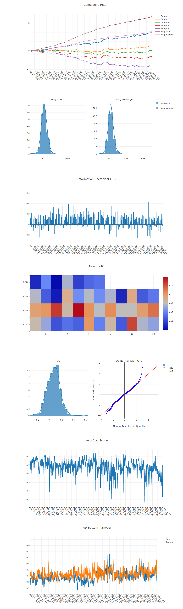
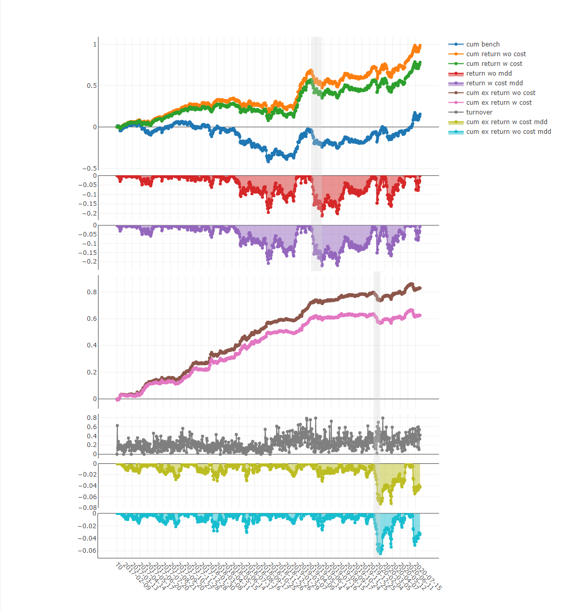

Qlib is a an AI-oriented quantitative investment platform.  aims to realize the potential, empower the research, and create the value of AI technologies in quantitative investment.

With you Qlib, you can easily apply your favorite model to create better Quant investment strategy.


- [Framework of Qlib](#framework-of-qlib)
- [Quick start](#quick-start)
  - [Installation](#installation)
  - [Get Data](#get-data)
  - [Auto Quant research workflow with _estimator_](#auto-quant-research-workflow-with-estimator)
  - [Customized Quant research workflow by code](#customized-quant-research-workflow-by-code)
- [More About Qlib](#more-about-qlib)
  - [Offline mode and online mode](#offline-mode-and-online-mode)
  - [Performance of Qlib Data Server](#performance-of-qlib-data-server)


# Framework of Qlib


At module level, Qlib is a platform that consists of the above components. Each components is loose-coupling and can be used stand-alone.

| Name | Description|
|------| -----|
| _Data layer_ | _DataServer_ focus on providing high performance infrastructure  for user to retreive and get raw data. _DataEnhancement_ will preprocess the data and provide the best dataset to be fed in to the models  |
| _Interday Model_ | _Interday model_ focus on produce forecasting signals(aka. _alpha_). Models are trained by _Model Creator_ and managed by _Model Manager_. User could choose one or multiple models for forecasting. Multiple models could be combined with _Ensemble_ module  |
| _Interday Strategy_ | _Portfolio Generator_ will take forecasting signals as input and output the orders based on current position to achieve target portfolio  | 
| _Intraday Trading_ | _Order Executor_ is responsible for executing orders output by _Interday Strategy_ and returning the executed results. |
| _Analysis_ |  User could get detailed analysis report of forecasting signal and portfolio in this part. |

* The modules with hand-drawn style is under development and will be  released in the future.
* The modules with dashed border is highly user-customizable and extendible.


# Quick start

## Installation

To install Qlib from source you need _Cython_ in addition to the normal dependencies above:

```bash
pip install cython
```

Clone the repository and then run:
```bash
python setup.py install
```


## Get Data
- Load and prepare the Data: execute the following command to load the stock data:
  ```bash
  python scripts/get_data.py qlib_data_cn --target_dir ~/.qlib/qlib_data/cn_data
  ```
<!-- 
- Run the initialization code and get stock data:

  ```python
  import qlib
  from qlib.data import D
  from qlib.config import REG_CN

  # Initialization
  mount_path = "~/.qlib/qlib_data/cn_data"  # target_dir
  qlib.init(mount_path=mount_path, region=REG_CN)

  # Get stock data by Qlib
  # Load trading calendar with the given time range and frequency
  print(D.calendar(start_time='2010-01-01', end_time='2017-12-31', freq='day')[:2])

  # Parse a given market name into a stockpool config
  instruments = D.instruments('csi500')
  print(D.list_instruments(instruments=instruments, start_time='2010-01-01', end_time='2017-12-31', as_list=True)[:6])

  # Load features of certain instruments in given time range
  instruments = ['SH600000']
  fields = ['$close', '$volume', 'Ref($close, 1)', 'Mean($close, 3)', '$high-$low']
  print(D.features(instruments, fields, start_time='2010-01-01', end_time='2017-12-31', freq='day').head())
  ```
 -->

## Auto Quant research workflow with _estimator_
Qlib provides a tool named `estimator` to run whole workflow automatically(including building dataset, train models, backtest, analysis)

1. Run _estimator_ (_config.yaml_ for: [estimator_config.yaml](example/estimator/estimator_config.yaml)):

    ```bash
    estimator -c example/estimator/estimator_config.yaml
    ```
  
    Estimator result:
  
    ```bash
    pred_long       mean    0.001386
                    std     0.004403
                    annual  0.349379
                    sharpe  4.998428
                    mdd    -0.049486
    pred_short      mean    0.002703
                    std     0.004680
                    annual  0.681071
                    sharpe  9.166842
                    mdd    -0.053523
    pred_long_short mean    0.004089
                    std     0.007028
                    annual  1.030451
                    sharpe  9.236475
                    mdd    -0.045817
    sub_bench       mean    0.000953
                    std     0.004688
                    annual  0.240123
                    sharpe  3.226878
                    mdd    -0.064588
    sub_cost        mean    0.000718
                    std     0.004694
                    annual  0.181003
                    sharpe  2.428964
                    mdd    -0.072977
    ```
    See the full documnents for [Use _Estimator_ to Start An Experiment](TODO:URL).

2. Analysis

    Run `examples/estimator/analyze_from_estimator.ipynb` in `jupyter notebook`
    1.  forecasting signal analysis
        - Model Performance
        

    2.  portfolio analysis
        - Report
        
        <!-- 
        - Score IC
        
        - Cumulative Return
        
        - Risk Analysis
        
        - Rank Label
        
        -->

## Customized Quant research workflow by code
Automatical workflow may not suite the research workflow of all Quant researchers. To support flexible Quant research workflow, Qlib also provide modulized interface to allow researchers to build their own workflow. [Here](TODO_URL) is a demo for customized Quant research workflow by code


# More About Qlib
The detailed documents are organized in [docs](docs).
[Sphinx](http://www.sphinx-doc.org) and the readthedocs theme is required to build the documentation in html formats. 
```bash
cd docs/
conda install sphinx sphinx_rtd_theme -y
# Otherwise, you can install them with pip
# pip install sphinx sphinx_rtd_theme
make html
```
You can also view the [latest document](TODO_URL) online directly.


## Offline mode and online mode
The data server of Qlib can both deployed as offline mode and online mode. The default  mode is offline mode.

Under offline mode, the data will be deployed locally. 

Under online mode, the data will be deployed as a shared data service. The data and their cache will be shared by clients. The data retrieving performance is expected to be improved due to higher rate of cache hits. It will use less disk space, too. The documents of the online mode can be found in [Qlib-Server](TODO_link). The online mode can be deployed automatically with [Azure CLI based scripts](TODO_link)

## Performance of Qlib Data Server
The performance of data processing is important to datadriven methods like AI technologies. As an AI-oriented platform, Qlib provides a solution for data storage and data processing. To demonstrate the performance of Qlib, We
compare Qlib with several other solutions. 

The task for the solutions is to create a dataset from the
basic OHLCV daily data of a stock market, which involves
data query and processing.


Most general purpose databases take too much time on loading data. After looking into the underlying implementation, we find that data go through too many layers of interfaces and unnecessary format transformations in general purpose database solution.
Such overheads greatly slow down the data loading process.
Qlib data are stored in a compact format, which is efficient to be combined into arrays for scientific computation.


# Contributing

This project welcomes contributions and suggestions.  Most contributions require you to agree to a
Contributor License Agreement (CLA) declaring that you have the right to, and actually do, grant us
the rights to use your contribution. For details, visit https://cla.opensource.microsoft.com.

When you submit a pull request, a CLA bot will automatically determine whether you need to provide
a CLA and decorate the PR appropriately (e.g., status check, comment). Simply follow the instructions
provided by the bot. You will only need to do this once across all repos using our CLA.

This project has adopted the [Microsoft Open Source Code of Conduct](https://opensource.microsoft.com/codeofconduct/).
For more information see the [Code of Conduct FAQ](https://opensource.microsoft.com/codeofconduct/faq/) or
contact [opencode@microsoft.com](mailto:opencode@microsoft.com) with any additional questions or comments.
