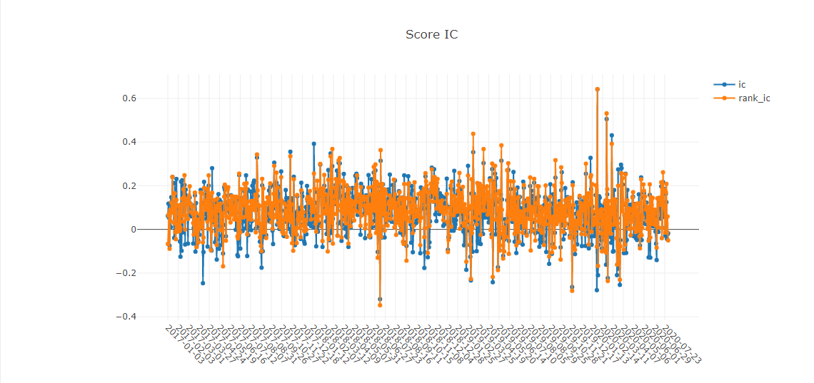
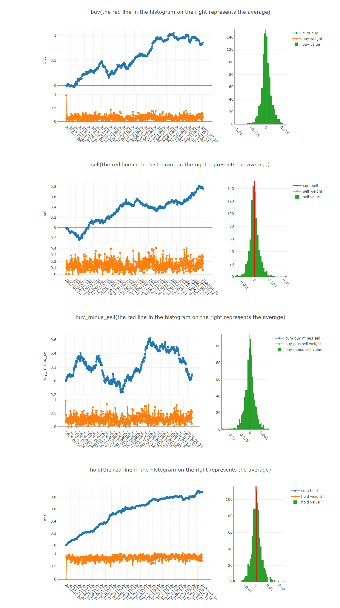
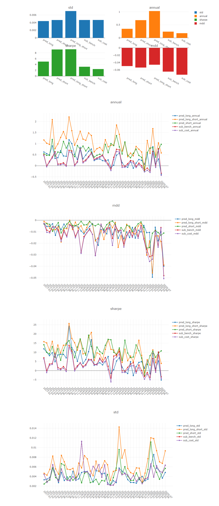
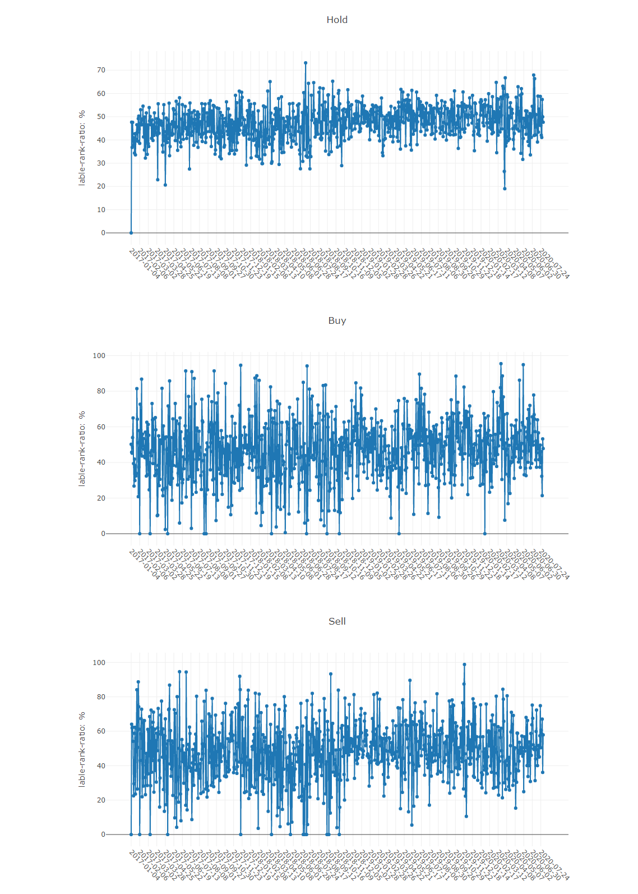

[](https://pypi.org/project/pyqlib/#files)
[](https://pypi.org/project/pyqlib/#files)
[](https://pypi.org/project/pyqlib/#history)
[](https://pypi.org/project/pyqlib/)
[](https://github.com/microsoft/qlib/actions)
[](https://qlib.readthedocs.io/en/latest/?badge=latest)
[](LICENSE)
[](https://gitter.im/Microsoft/qlib?utm_source=badge&utm_medium=badge&utm_campaign=pr-badge&utm_content=badge)


<p align="center">
  
</p>


Qlib is an AI-oriented quantitative investment platform, which aims to realize the potential, empower the research, and create the value of AI technologies in quantitative investment.

It contains the full ML pipeline of data processing, model training, back-testing; and covers the entire chain of quantitative investment: alpha seeking, risk modeling, portfolio optimization, and order execution. 

With Qlib, user can easily try ideas to create better Quant investment strategies.

For more details, please refer to our paper ["Qlib: An AI-oriented Quantitative Investment Platform"](https://arxiv.org/abs/2009.11189).

- [Framework of Qlib](#framework-of-qlib)
- [Quick Start](#quick-start)
  - [Installation](#installation)
  - [Data Preparation](#data-preparation)
  - [Auto Quant Research Workflow](#auto-quant-research-workflow)
  - [Building Customized Quant Research Workflow by Code](#building-customized-quant-research-workflow-by-code)
- [**Quant Model Zoo**](#quant-model-zoo)
  - [Run a single model](#run-a-single-model)
  - [Run multiple models](#run-multiple-models)
- [**Quant Dataset Zoo**](#quant-dataset-zoo)
- [More About Qlib](#more-about-qlib)
- [Offline Mode and Online Mode](#offline-mode-and-online-mode)
  - [Performance of Qlib Data Server](#performance-of-qlib-data-server)
- [Contributing](#contributing)


# Framework of Qlib

<div style="align: center">

</div>


At the module level, Qlib is a platform that consists of the above components. The components are designed as loose-coupled modules and each component could be used stand-alone.

| Name                   | Description                                                                                                                                                                                                                                                                                                                                                             |
| ------                 | -----                                                                                                                                                                                                                                                                                                                                                                   |
| `Infrastructure` layer | `Infrastructure` layer provides underlying support for Quant research. `DataServer` provides high-performance infrastructure for users to manage and retrieve raw data. `Trainer` provides flexible interface to control the training process of models which enable algorithms controlling the training process.                                                       |
| `Workflow` layer       | `Workflow` layer covers the whole workflow of quantitative investment. `Information Extractor` extracts data for models. `Forecast Model` focuses on producing all kinds of forecast signals (e.g. _alpha_, risk) for other modules. With these signals `Portfolio Generator` will generate the target portfolio and produce orders to be executed by `Order Executor`. |
| `Interface` layer      | `Interface` layer tries to present a user-friendly interface for the underlying system. `Analyser` module will provide users detailed analysis reports of forecasting signals, portfolios and execution results                                                                                                                                                                 |

* The modules with hand-drawn style are under development and will be released in the future.
* The modules with dashed borders are highly user-customizable and extendible.


# Quick Start

This quick start guide tries to demonstrate
1. It's very easy to build a complete Quant research workflow and try your ideas with _Qlib_.
2. Though with *public data* and *simple models*, machine learning technologies **work very well** in practical Quant investment.

Here is a quick **[demo](https://terminalizer.com/view/3f24561a4470)** shows how to install ``Qlib``, and run LightGBM with ``qrun``. **But**, please make sure you have already prepared the data following the [instruction](#data-preparation).


## Installation

Users can easily install ``Qlib`` by pip according to the following command(Currently, Qlib only support Python 3.6, 3.7 and 3.8). 

```bash
  pip install pyqlib
```

**Note**: pip will install the latest stable qlib. However, the main branch of qlib is in active development. If you want to test the latest scripts or functions in the main branch. Please install qlib with the methods below.

Also, users can install the latest dev version ``Qlib`` by the source code according to the following steps:

* Before installing ``Qlib`` from source, users need to install some dependencies:

  ```bash
  pip install numpy
  pip install --upgrade  cython
  ```
  **Note**: Please pay attention that installing cython in Python 3.6 will raise some error when installing ``Qlib`` from source. If users use Python 3.6 on their machines, it is recommended to *upgrade* Python to version 3.7 or use `conda`'s Python to install ``Qlib`` from source.

* Clone the repository and install ``Qlib`` as follows.
  * If you haven't installed qlib by the command ``pip install pyqlib`` before:
    ```bash
    git clone https://github.com/microsoft/qlib.git && cd qlib
    python setup.py install
    ```
  * If you have already installed the stable version by the command ``pip install pyqlib``:
    ```bash
    git clone https://github.com/microsoft/qlib.git && cd qlib
    pip install .
    ```
  **Note**: **Only** the command ``pip install .`` **can** overwrite the stable version installed by ``pip install pyqlib``, while the command ``python setup.py install`` **can't**.

## Data Preparation
Load and prepare data by running the following code:
  ```bash
  python scripts/get_data.py qlib_data --target_dir ~/.qlib/qlib_data/cn_data --region cn
  ```

This dataset is created by public data collected by [crawler scripts](scripts/data_collector/), which have been released in
the same repository.
Users could create the same dataset with it. 

*Please pay **ATTENTION** that the data is collected from [Yahoo Finance](https://finance.yahoo.com/lookup) and the data might not be perfect. We recommend users to prepare their own data if they have high-quality dataset. For more information, users can refer to the [related document](https://qlib.readthedocs.io/en/latest/component/data.html#converting-csv-format-into-qlib-format)*.

<!-- 
- Run the initialization code and get stock data:

  ```python
  import qlib
  from qlib.data import D
  from qlib.config import REG_CN

  # Initialization
  mount_path = "~/.qlib/qlib_data/cn_data"  # target_dir
  qlib.init(mount_path=mount_path, region=REG_CN)

  # Get stock data by Qlib
  # Load trading calendar with the given time range and frequency
  print(D.calendar(start_time='2010-01-01', end_time='2017-12-31', freq='day')[:2])

  # Parse a given market name into a stockpool config
  instruments = D.instruments('csi500')
  print(D.list_instruments(instruments=instruments, start_time='2010-01-01', end_time='2017-12-31', as_list=True)[:6])

  # Load features of certain instruments in given time range
  instruments = ['SH600000']
  fields = ['$close', '$volume', 'Ref($close, 1)', 'Mean($close, 3)', '$high-$low']
  print(D.features(instruments, fields, start_time='2010-01-01', end_time='2017-12-31', freq='day').head())
  ```
 -->

## Auto Quant Research Workflow
Qlib provides a tool named `qrun` to run the whole workflow automatically (including building dataset, training models, backtest and evaluation). You can start an auto quant research workflow and have a graphical reports analysis according to the following steps: 

1. Quant Research Workflow: Run  `qrun` with lightgbm workflow config ([workflow_config_lightgbm_Alpha158.yaml](examples/benchmarks/LightGBM/workflow_config_lightgbm_Alpha158.yaml) as following.
    ```bash
      cd examples  # Avoid running program under the directory contains `qlib`
      qrun benchmarks/LightGBM/workflow_config_lightgbm_Alpha158.yaml
    ```
    The result of `qrun` is as follows, please refer to [Intraday Trading](https://qlib.readthedocs.io/en/latest/component/backtest.html) for more details about the result. 

    ```bash

    'The following are analysis results of the excess return without cost.'
                           risk
    mean               0.000708
    std                0.005626
    annualized_return  0.178316
    information_ratio  1.996555
    max_drawdown      -0.081806
    'The following are analysis results of the excess return with cost.'
                           risk
    mean               0.000512
    std                0.005626
    annualized_return  0.128982
    information_ratio  1.444287
    max_drawdown      -0.091078
    ```
    Here are detailed documents for `qrun` and [workflow](https://qlib.readthedocs.io/en/latest/component/workflow.html).

2. Graphical Reports Analysis: Run `examples/workflow_by_code.ipynb` with `jupyter notebook` to get graphical reports
    - Forecasting signal (model prediction) analysis
      - Cumulative Return of groups
      
      - Return distribution
      
      - Information Coefficient (IC)
              
      
      
      - Auto Correlation of forecasting signal (model prediction)
      

    - Portfolio analysis
      - Backtest return
      
      <!-- 
      - Score IC
      
      - Cumulative Return
      
      - Risk Analysis
      
      - Rank Label
      
      -->

## Building Customized Quant Research Workflow by Code
The automatic workflow may not suite the research workflow of all Quant researchers. To support a flexible Quant research workflow, Qlib also provides a modularized interface to allow researchers to build their own workflow by code. [Here](examples/workflow_by_code.ipynb) is a demo for customized Quant research workflow by code.


# [Quant Model Zoo](examples/benchmarks)

Here is a list of models built on `Qlib`.
- [GBDT based on LightGBM (Guolin Ke, et al.)](qlib/contrib/model/gbdt.py)
- [GBDT based on Catboost (Liudmila Prokhorenkova, et al.)](qlib/contrib/model/catboost_model.py)
- [GBDT based on XGBoost (Tianqi Chen, et al.)](qlib/contrib/model/xgboost.py)
- [MLP based on pytorch](qlib/contrib/model/pytorch_nn.py)
- [GRU based on pytorch (Kyunghyun Cho, et al.)](qlib/contrib/model/pytorch_gru.py)
- [LSTM based on pytorcn (Sepp Hochreiter, et al.)](qlib/contrib/model/pytorch_lstm.py)
- [ALSTM based on pytorcn (Yao Qin, et al.)](qlib/contrib/model/pytorch_alstm.py)
- [GATs based on pytorch (Petar Velickovic, et al.)](qlib/contrib/model/pytorch_gats.py)
- [SFM based on pytorch (Liheng Zhang, et al.)](qlib/contrib/model/pytorch_sfm.py)
- [TFT based on tensorflow (Bryan Lim, et al.)](examples/benchmarks/TFT/tft.py)

Your PR of new Quant models is highly welcomed.

The performance of each model on the `Alpha158` and `Alpha360` dataset can be found [here](examples/benchmarks/README.md).

## Run a single model
All the models listed above are runnable with ``Qlib``. Users can find the config files we provide and some details about the model through the [benchmarks](examples/benchmarks) folder. More information can be retrieved at the model files listed above.

`Qlib` provides three different ways to run a single model, users can pick the one that fits their cases best:
- User can use the tool `qrun` mentioned above to run a model's workflow based from a config file.
- User can create a `workflow_by_code` python script based on the [one](examples/workflow_by_code.py) listed in the `examples` folder.

- User can use the script [`run_all_model.py`](examples/run_all_model.py) listed in the `examples` folder to run a model. Here is an example of the specific shell command to be used: `python run_all_model.py --models=lightgbm`, where the `--models` arguments can take any number of models listed above(the available models can be found  in [benchmarks](examples/benchmarks/)). For more use cases, please refer to the file's [docstrings](examples/run_all_model.py).

## Run multiple models
`Qlib` also provides a script [`run_all_model.py`](examples/run_all_model.py) which can run multiple models for several iterations. (**Note**: the script only support *Linux* for now. Other OS will be supported in the future. Besides, it doesn't support parrallel running the same model for multiple times as well, and this will be fixed in the future development too.)

The script will create a unique virtual environment for each model, and delete the environments after training. Thus, only experiment results such as `IC` and `backtest` results will be generated and stored.

Here is an example of running all the models for 10 iterations:
```python
python run_all_model.py 10
```

It also provides the API to run specific models at once. For more use cases, please refer to the file's [docstrings](examples/run_all_model.py). 


# Quant Dataset Zoo
Dataset plays a very important role in Quant. Here is a list of the datasets built on `Qlib`:

| Dataset                                    | US Market | China Market |
| --                                         | --        | --           |
| [Alpha360](./qlib/contrib/data/handler.py) |  √        |  √           |
| [Alpha158](./qlib/contrib/data/handler.py) |  √        |  √           |

[Here](https://qlib.readthedocs.io/en/latest/advanced/alpha.html) is a tutorial to build dataset with `Qlib`.
Your PR to build new Quant dataset is highly welcomed.

# More About Qlib
The detailed documents are organized in [docs](docs/).
[Sphinx](http://www.sphinx-doc.org) and the readthedocs theme is required to build the documentation in html formats. 
```bash
cd docs/
conda install sphinx sphinx_rtd_theme -y
# Otherwise, you can install them with pip
# pip install sphinx sphinx_rtd_theme
make html
```
You can also view the [latest document](http://qlib.readthedocs.io/) online directly.

Qlib is in active and continuing development. Our plan is in the roadmap, which is managed as a [github project](https://github.com/microsoft/qlib/projects/1).


# Offline Mode and Online Mode
The data server of Qlib can either deployed as `Offline` mode or `Online` mode. The default mode is offline mode.

Under `Offline` mode, the data will be deployed locally. 

Under `Online` mode, the data will be deployed as a shared data service. The data and their cache will be shared by all the clients. The data retrieval performance is expected to be improved due to a higher rate of cache hits. It will consume less disk space, too. The documents of the online mode can be found in [Qlib-Server](https://qlib-server.readthedocs.io/). The online mode can be deployed automatically with [Azure CLI based scripts](https://qlib-server.readthedocs.io/en/latest/build.html#one-click-deployment-in-azure). The source code of online data server can be found in [Qlib-Server repository](https://github.com/microsoft/qlib-server).

## Performance of Qlib Data Server
The performance of data processing is important to data-driven methods like AI technologies. As an AI-oriented platform, Qlib provides a solution for data storage and data processing. To demonstrate the performance of Qlib data server, we
compare it with several other data storage solutions. 

We evaluate the performance of several storage solutions by finishing the same task,
which creates a dataset (14 features/factors) from the basic OHLCV daily data of a stock market (800 stocks each day from 2007 to 2020). The task involves data queries and processing.

|                         | HDF5      | MySQL     | MongoDB   | InfluxDB  | Qlib -E -D  | Qlib +E -D   | Qlib +E +D  |
| --                      | ------    | ------    | --------  | --------- | ----------- | ------------ | ----------- |
| Total (1CPU) (seconds)  | 184.4±3.7 | 365.3±7.5 | 253.6±6.7 | 368.2±3.6 | 147.0±8.8   | 47.6±1.0     | **7.4±0.3** |
| Total (64CPU) (seconds) |           |           |           |           | 8.8±0.6     | **4.2±0.2**  |             |
* `+(-)E` indicates with (out) `ExpressionCache`
* `+(-)D` indicates with (out) `DatasetCache`

Most general-purpose databases take too much time on loading data. After looking into the underlying implementation, we find that data go through too many layers of interfaces and unnecessary format transformations in general-purpose database solutions.
Such overheads greatly slow down the data loading process.
Qlib data are stored in a compact format, which is efficient to be combined into arrays for scientific computation.


# Contributing

This project welcomes contributions and suggestions.  Most contributions require you to agree to a
Contributor License Agreement (CLA) declaring that you have the right to, and actually do, grant us
the right to use your contribution. For details, visit https://cla.opensource.microsoft.com.

When you submit a pull request, a CLA bot will automatically determine whether you need to provide
a CLA and decorate the PR appropriately (e.g., status check, comment). Simply follow the instructions
provided by the bot. You will only need to do this once across all repos using our CLA.

This project has adopted the [Microsoft Open Source Code of Conduct](https://opensource.microsoft.com/codeofconduct/).
For more information see the [Code of Conduct FAQ](https://opensource.microsoft.com/codeofconduct/faq/) or
contact [opencode@microsoft.com](mailto:opencode@microsoft.com) with any additional questions or comments.
