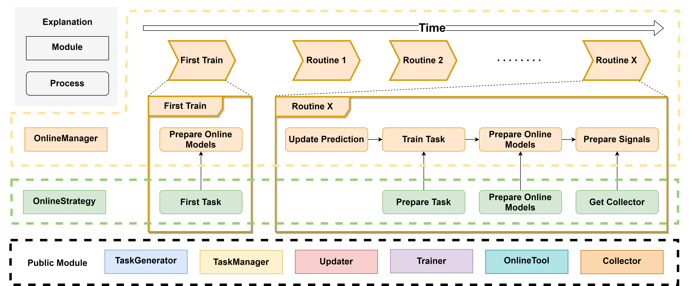

.. _online_serving:

==============
Online Serving
==============
.. currentmodule:: qlib

Introduction
============

In addition to backtesting, one way to test a model is effective is to make predictions in real market conditions or even do real trading based on those predictions.
``Online Serving`` is a set of modules for online models using the latest data,
which including `Online Manager <#Online Manager>`_, `Online Strategy <#Online Strategy>`_, `Online Tool <#Online Tool>`_, `Updater <#Updater>`_.

`Here <https://github.com/microsoft/qlib/tree/main/examples/online_srv>`_ are several examples for reference, which demonstrate different features of ``Online Serving``.
If you have many models or `task` needs to be managed, please consider `Task Management <../advanced/task_management.html>`_.
The `examples <https://github.com/microsoft/qlib/tree/main/examples/online_srv>`_ are based on some components in `Task Management <../advanced/task_management.html>`_ such as ``TrainerRM`` or ``Collector``.

**NOTE**: User should keep his data source updated to support online serving. For example, Qlib provides `a batch of scripts <https://github.com/microsoft/qlib/blob/main/scripts/data_collector/yahoo/README.md#automatic-update-of-daily-frequency-datafrom-yahoo-finance>`_ to help users update Yahoo daily data.

Known limitations currently
- Currently, the daily updating prediction for the next trading day is supported. But generating orders for the next trading day is not supported due to the `limitations of public data <https://github.com/microsoft/qlib/issues/215#issuecomment-766293563>_`

Online Manager
==============

.. automodule:: qlib.workflow.online.manager
    :members:
    :noindex:

Online Strategy
===============

.. automodule:: qlib.workflow.online.strategy
    :members:
    :noindex:

Online Tool
===========

.. automodule:: qlib.workflow.online.utils
    :members:
    :noindex:

Updater
=======

.. automodule:: qlib.workflow.online.update
    :members:
    :noindex:
