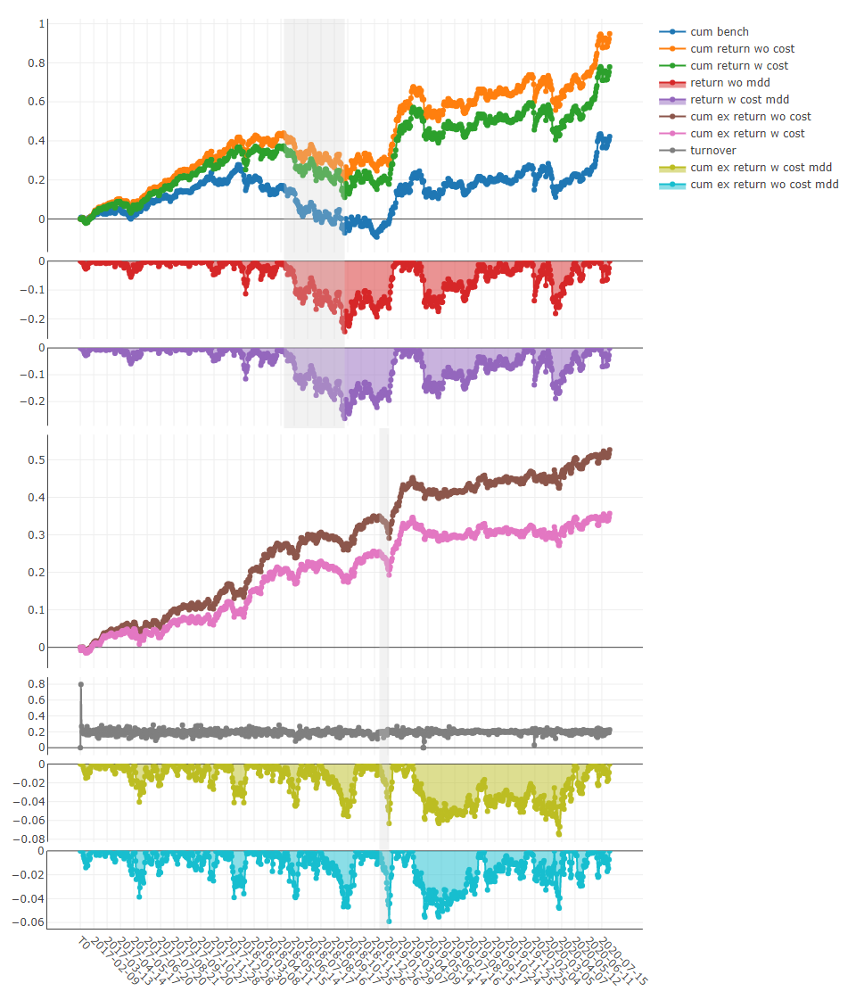
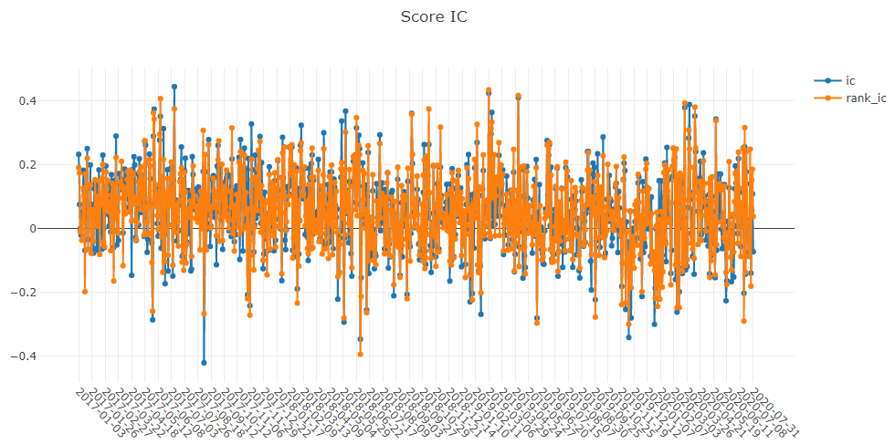
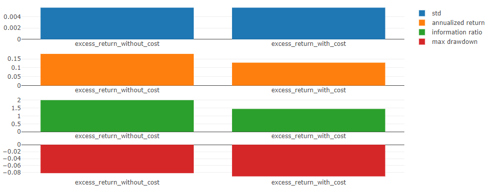
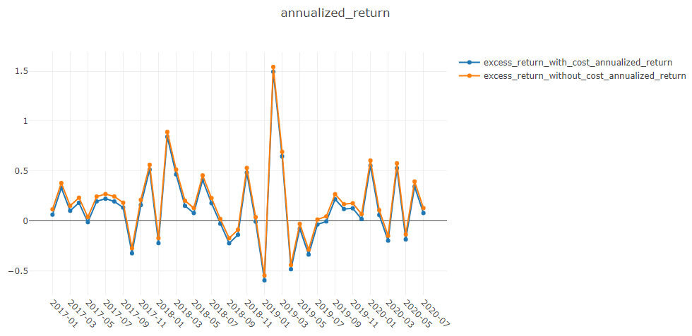
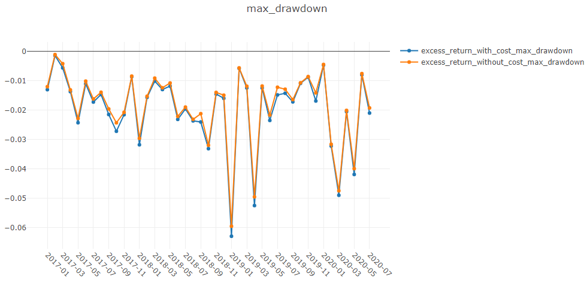
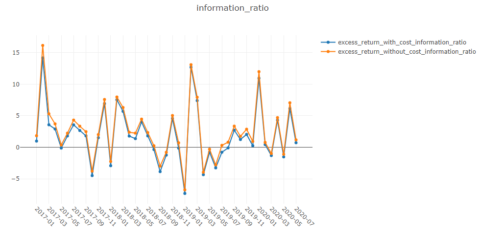
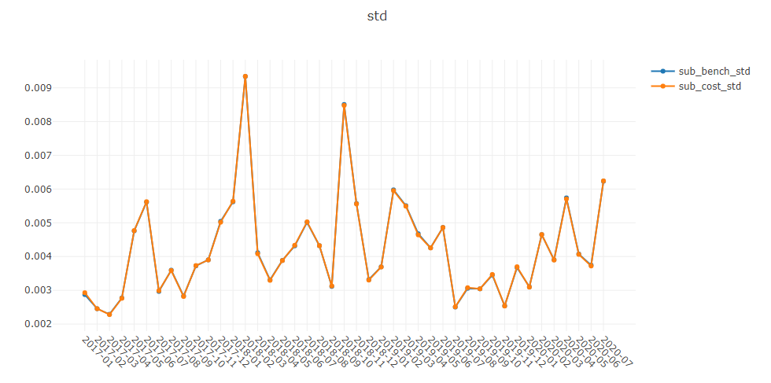
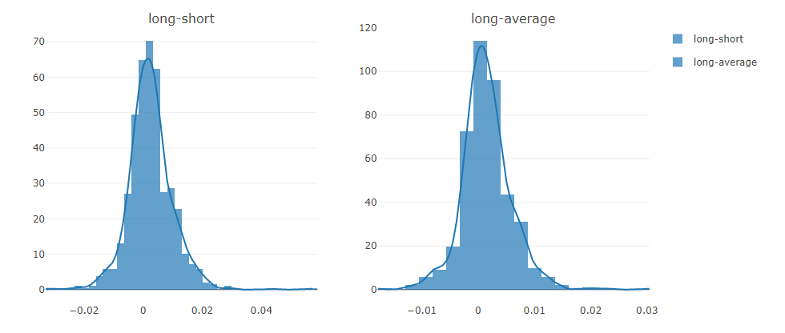
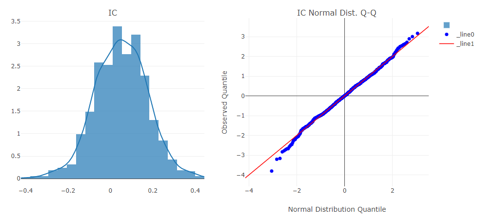
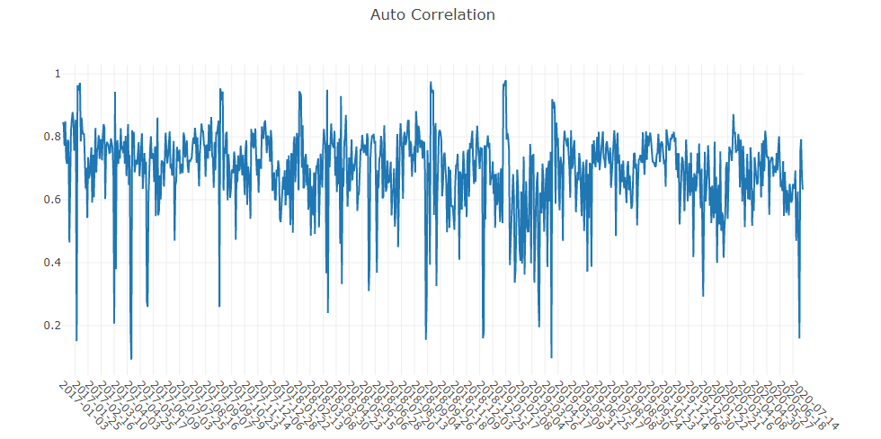

.. _report:

==========================================
Analysis: Evaluation & Results Analysis
==========================================

Introduction
===================

``Analysis`` is designed to show the graphical reports of ``Intraday Trading`` , which helps users to evaluate and analyse investment portfolios visually. The following are some graphics to view:

- analysis_position
    - report_graph
    - score_ic_graph
    - cumulative_return_graph
    - risk_analysis_graph
    - rank_label_graph

- analysis_model
    - model_performance_graph

Graphical Reports
===================

Users can run the following code to get all supported reports.

.. code-block:: python

    >> import qlib.contrib.report as qcr
    >> print(qcr.GRAPH_NAME_LIST)
    ['analysis_position.report_graph', 'analysis_position.score_ic_graph', 'analysis_position.cumulative_return_graph', 'analysis_position.risk_analysis_graph', 'analysis_position.rank_label_graph', 'analysis_model.model_performance_graph']

.. note::

    For more details, please refer to the function document: similar to ``help(qcr.analysis_position.report_graph)``

Usage & Example
===================

Usage of `analysis_position.report`
-----------------------------------

API
~~~~~~~~~~~~~~~~

.. automodule:: qlib.contrib.report.analysis_position.report
    :members:

Graphical Result
~~~~~~~~~~~~~~~~

.. note::

    - Axis X: Trading day
    - Axis Y: 
        - `cum bench`
            Cumulative returns series of benchmark
        - `cum return wo cost`
            Cumulative returns series of portfolio without cost
        - `cum return w cost`
            Cumulative returns series of portfolio with cost
        - `return wo mdd`
            Maximum drawdown series of cumulative return without cost
        - `return w cost mdd`:
            Maximum drawdown series of cumulative return with cost
        - `cum ex return wo cost`
            The `CAR` (cumulative abnormal return) series of the portfolio compared to the benchmark without cost.
        - `cum ex return w cost`
            The `CAR` (cumulative abnormal return) series of the portfolio compared to the benchmark with cost.
        - `turnover`
            Turnover rate series
        - `cum ex return wo cost mdd`
            Drawdown series of `CAR` (cumulative abnormal return) without cost
        - `cum ex return w cost mdd`
            Drawdown series of `CAR` (cumulative abnormal return) with cost
    - The shaded part above: Maximum drawdown corresponding to `cum return wo cost`
    - The shaded part below: Maximum drawdown corresponding to `cum ex return wo cost`

Usage of `analysis_position.score_ic`
-------------------------------------

API
~~~~~~~~~~~~~~~~

.. automodule:: qlib.contrib.report.analysis_position.score_ic
    :members:

Graphical Result
~~~~~~~~~~~~~~~~~

.. note:: 

    - Axis X: Trading day
    - Axis Y: 
        - `ic`
            The `Pearson correlation coefficient` series between `label` and `prediction score`.
            In the above example, the `label` is formulated as `Ref($close, -1)/$close - 1`. Please refer to `Data Feature <data.html#feature>`_ for more details.
                
        - `rank_ic`
            The `Spearman's rank correlation coefficient` series between `label` and `prediction score`.

.. Usage of `analysis_position.cumulative_return`
.. ----------------------------------------------
..
.. API
.. ~~~~~~~~~~~~~~~~
..
.. .. automodule:: qlib.contrib.report.analysis_position.cumulative_return
..     :members:
..
.. Graphical Result
.. ~~~~~~~~~~~~~~~~~
..
.. .. note:: 
..
..     - Axis X: Trading day
..     - Axis Y:
..         - Above axis Y: `(((Ref($close, -1)/$close - 1) * weight).sum() / weight.sum()).cumsum()`
..         - Below axis Y: Daily weight sum
..     - In the **sell** graph, `y < 0` stands for profit; in other cases, `y > 0` stands for profit.
..     - In the **buy_minus_sell** graph, the **y** value of the **weight** graph at the bottom is `buy_weight + sell_weight`.
..     - In each graph, the **red line** in the histogram on the right represents the average.
..
.. .. image:: ../_static/img/analysis/cumulative_return_buy.png 
..
.. .. image:: ../_static/img/analysis/cumulative_return_sell.png 
..
.. .. image:: ../_static/img/analysis/cumulative_return_buy_minus_sell.png 
..
.. .. image:: ../_static/img/analysis/cumulative_return_hold.png 

Usage of `analysis_position.risk_analysis`
----------------------------------------------

API
~~~~~~~~~~~~~~~~

.. automodule:: qlib.contrib.report.analysis_position.risk_analysis
    :members:

Graphical Result
~~~~~~~~~~~~~~~~~

.. note::

    - general graphics
        - `std`
            - `excess_return_without_cost`
                The `Standard Deviation` of `CAR` (cumulative abnormal return) without cost.
            - `excess_return_with_cost`
                The `Standard Deviation` of `CAR` (cumulative abnormal return) with cost.
        - `annualized_return`
            - `excess_return_without_cost`
                The `Annualized Rate` of `CAR` (cumulative abnormal return) without cost.
            - `excess_return_with_cost`
                The `Annualized Rate` of `CAR` (cumulative abnormal return) with cost.
        -  `information_ratio`
            - `excess_return_without_cost`
                The `Information Ratio` without cost.
            - `excess_return_with_cost`
                The `Information Ratio` with cost.
            To know more about `Information Ratio`, please refer to `Information Ratio – IR <https://www.investopedia.com/terms/i/informationratio.asp>`_.
        -  `max_drawdown`
            - `excess_return_without_cost`
                The `Maximum Drawdown` of `CAR` (cumulative abnormal return) without cost.
            - `excess_return_with_cost`
                The `Maximum Drawdown` of `CAR` (cumulative abnormal return) with cost.

.. note::

    - annualized_return/max_drawdown/information_ratio/std graphics
        - Axis X: Trading days grouped by month
        - Axis Y:
            - annualized_return graphics
                - `excess_return_without_cost_annualized_return`
                    The `Annualized Rate` series of monthly `CAR` (cumulative abnormal return) without cost.
                - `excess_return_with_cost_annualized_return`
                    The `Annualized Rate` series of monthly `CAR` (cumulative abnormal return) with cost.
            - max_drawdown graphics
                - `excess_return_without_cost_max_drawdown`
                    The `Maximum Drawdown` series of monthly `CAR` (cumulative abnormal return) without cost.
                - `excess_return_with_cost_max_drawdown`
                    The `Maximum Drawdown` series of monthly `CAR` (cumulative abnormal return) with cost.
            - information_ratio graphics
                - `excess_return_without_cost_information_ratio`
                    The `Information Ratio` series of monthly `CAR` (cumulative abnormal return) without cost.
                - `excess_return_with_cost_information_ratio`
                    The `Information Ratio` series of monthly `CAR` (cumulative abnormal return) with cost.
            - std graphics
                - `excess_return_without_cost_max_drawdown`
                    The `Standard Deviation` series of monthly `CAR` (cumulative abnormal return) without cost.
                - `excess_return_with_cost_max_drawdown`
                    The `Standard Deviation` series of monthly `CAR` (cumulative abnormal return) with cost.
                

..
.. Usage of `analysis_position.rank_label`
.. ----------------------------------------------
..
.. API
.. ~~~~~
..
.. .. automodule:: qlib.contrib.report.analysis_position.rank_label
..     :members:
..
..
.. Graphical Result
.. ~~~~~~~~~~~~~~~~~
..
.. .. note:: 
..
..     - hold/sell/buy graphics:
..         - Axis X: Trading day
..         - Axis Y: 
..             Average `ranking ratio`of `label` for stocks that is held/sold/bought on the trading day.
..
..             In the above example, the `label` is formulated as `Ref($close, -1)/$close - 1`. The `ranking ratio` can be formulated as follows.
..             .. math::
..                 
..                 ranking\ ratio = \frac{Ascending\ Ranking\ of\ label}{Number\ of\ Stocks\ in\ the\ Portfolio}
..
.. .. image:: ../_static/img/analysis/rank_label_hold.png 
..     :align: center
..
.. .. image:: ../_static/img/analysis/rank_label_buy.png 
..     :align: center
..
.. .. image:: ../_static/img/analysis/rank_label_sell.png 
..     :align: center
..
..

Usage of `analysis_model.analysis_model_performance`
-----------------------------------------------------

API
~~~~~

.. automodule:: qlib.contrib.report.analysis_model.analysis_model_performance
    :members:

Graphical Results
~~~~~~~~~~~~~~~~~~

.. note::

    - cumulative return graphics
        - `Group1`:
            The `Cumulative Return` series of stocks group with (`ranking ratio` of label <= 20%)
        - `Group2`:
            The `Cumulative Return` series of stocks group with (20% < `ranking ratio` of label <= 40%)
        - `Group3`:
            The `Cumulative Return` series of stocks group with (40% < `ranking ratio` of label <= 60%)
        - `Group4`:
            The `Cumulative Return` series of stocks group with (60% < `ranking ratio` of label <= 80%)
        - `Group5`:
            The `Cumulative Return` series of stocks group with (80% < `ranking ratio` of label)
        - `long-short`:
            The Difference series between `Cumulative Return` of `Group1` and of `Group5`
        - `long-average`
            The Difference series between `Cumulative Return` of `Group1` and average `Cumulative Return` for all stocks.
        
        The `ranking ratio` can be formulated as follows.
            .. math::
                
                ranking\ ratio = \frac{Ascending\ Ranking\ of\ label}{Number\ of\ Stocks\ in\ the\ Portfolio}

.. image:: ../_static/img/analysis/analysis_model_cumulative_return.png 
    :align: center

.. note::
    - long-short/long-average
        The distribution of long-short/long-average returns on each trading day

.. TODO: ask xiao yang for detial

.. note::
    - Information Coefficient
        - The `Pearson correlation coefficient` series between `labels` and `prediction scores` of stocks in portfolio.
        - The graphics reports can be used to evaluate the `prediction scores`.

.. image:: ../_static/img/analysis/analysis_model_IC.png 
    :align: center

.. note::
    - Monthly IC
        Monthly average of the `Information Coefficient`

.. image:: ../_static/img/analysis/analysis_model_monthly_IC.png 
    :align: center

.. note::
    - IC
        The distribution of the `Information Coefficient` on each trading day.
    - IC Normal Dist. Q-Q
        The `Quantile-Quantile Plot` is used for the normal distribution of `Information Coefficient` on each trading day.

.. note::
    - Auto Correlation
        - The `Pearson correlation coefficient` series between the latest `prediction scores` and the `prediction scores` `lag` days ago of stocks in portfolio on each trading day. 
        - The graphics reports can be used to estimate the turnover rate.
         

