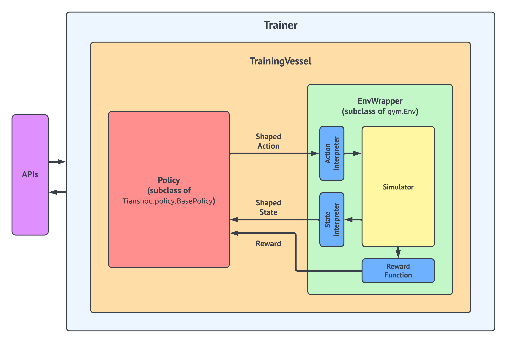

.. _rl:
========================================================================
Reinforcement Learning in Quantitative Trading
========================================================================
.. currentmodule:: qlib

Introduction
============
The Qlib Reinforcement Learning toolkit (QlibRL) is an RL platform for quantitative investment. It contains a full set of components that cover the entire lifecycle of an RL pipeline, including building the simulator of the market, shaping states & actions, training policies (strategies), and backtesting strategies in the simulated environment.

QlibRL is basically implemented with the support of Tianshou and Gym frameworks. The high-level structure of QlibRL is demonstrated below:

Here, we briefly introduce each component in the figure.

Base Modules
============

EnvWrapper
------------
EnvWrapper is the complete capsulation of the simulated environment. It receives actions from outside (policy / strategy / agent), simulates the changes of the market, and then replies rewards and updated states, thus forming an interaction loop.

In QlibRL, EnvWrapper is a subclass of gym.Env, so it implements all necessary interfaces of gym.Env. Any classes or pipelines that accept gym.Env should also accept EnvWrapper. Developers do not need to implement their own EnvWrapper to build their own environment. Instead, they only need to implement 4 components of the EnvWrapper:

- `Simulator`
    The simulator is the core component responsible for the environment simulation. Developers could implement all the logic that is directly related to the environment simulation in the Simulator in any way they like. In QlibRL, there are already two implementations of Simulator for single asset trading: 1) ``SingleAssetOrderExecution``, which is built based on Qlib's backtest toolkits and hence considers a lot of practical trading details but is slow. 2) ``SimpleSingleAssetOrderExecution``, which is built based on a simplified trading simulator, which ignores a lot of details (e.g. trading limitations, rounding) but is quite fast.
- `State interpreter` 
    The state interpreter is responsible for "interpret" states in the original format (format provided by the simulator) into states in a format that the policy could understand. For example, transform unstructured raw features into numerical tensors.
- `Action interpreter` 
    The action interpreter is similar to the state interpreter. But instead of states, it interprets actions generated by the policy, from the format provided by the policy to the format that is acceptable to the simulator.
- `Reward function` 
    The reward function returns a numerical reward to the policy after each time the policy takes an action. 

EnvWrapper will organically organize these components. Such decomposition allows for better flexibility in development. For example, if the developers want to train multiple types of policies in one same environment, they only need to design one simulator, and design different state interpreters / action interpreters / reward functions for a different types of policies.

QlibRL has well-defined base classes for all these 4 components. All the developers need to do is define their own components by inheriting the base classes and then implementing all interfaces required by the base classes.

Policy
------------
QlibRL directly uses Tianshou's policy. Developers could use policies provided by Tianshou off the shelf, or implement their own policies by inheriting Tianshou's policies.

Training Vessel & Trainer
------------
As stated by their names, training vessels and trainers are helper classes used in training. A training vessel is a ship that contains a simulator / interpreters / reward function / policy, and it controls algorithm-related parts of training. Correspondingly, the trainer is responsible for controlling the runtime parts of training.

As you may have noticed, a training vessel itself holds all the required components to build an EnvWrapper rather than holding an instance of EnvWrapper directly. This allows the training vessel to create duplicates of EnvWrapper dynamically when necessary (for example, under parallel training).

With a training vessel, the trainer could finally launch the training pipeline by simple, Scikit-learn-like interfaces (i.e., `trainer.fit()`).

Potential Application Scenarios
============

Portfolio Construction
------------
Portfolio construction is a process of selecting securities optimally by taking a minimum risk to achieve maximum returns. With an RL-based solution, an agent allocates stocks at every time step by obtaining information for each stock and the market. The key is to develop of policy for building a portfolio and make the policy able to pick the optimal portfolio. 

Order Execution
------------
As a fundamental problem in algorithmic trading, order execution aims at fulfilling a specific trading order, either liquidation or acquirement, for a given instrument. Essentially, the goal of order execution is twofold: it not only requires to fulfill the whole order but also targets a more economical execution with maximizing profit gain (or minimizing capital loss). The order execution with only one order of liquidation or acquirement is called single-asset order execution.

Considering stock investment always aim to pursue long-term maximized profits, is usually manifests as a sequential process of continuously adjusting the asset portfolios, execution for multiple orders, including order of liquidation and acquirement, brings more constraints and making the sequence of execution for different orders should be considered, e.g. before executing an order to buy some stocks, we have to sell at least one stock. The order execution with multiple assets is called multi-asset order execution. 

According to the order execution’s trait of sequential decision making, an RL-based solution could be applied to solve the order execution. With an RL-based solution, an agent optimizes execution strategy through interacting with the market environment. 

With QlibRL, the RL algorithm in the above scenarios can be easily implemented.

Nested Portfolio Construction and Order Executor
------------
QlibRL make it possible to jointly optimize different levels of strategies/models/agents. Take `Nested Decision Execution Framework <https://github.com/microsoft/qlib/blob/main/examples/nested_decision_execution>`_ an example of, optimization of order execution strategy and portfolio management strategy can interact with each other to maximize returns.

Base Class & Interface 
============
``Qlib`` provides a set of APIs for developers to further simplify their development, including base classes for Interpreter, Simulator and Reward.

.. autoclass:: qlib.rl.interpreter.Interpreter
    :members:

.. autoclass:: qlib.rl.simulator.Simulator
    :members:

.. autoclass:: qlib.rl.reward.Reward
    :members:

Example
============
``Qlib`` provides an example based on order execution, specifically, `qlib.rl.order_execution.simulator_qlib.SingleAssetOrderExecution<https://github.com/microsoft/qlib/blob/main/qlib/rl/order_execution/simulator_qlib.py>`_ and `qlib.rl.order_execution.simulator_simple.SingleAssetOrderExecutionSimple<https://github.com/microsoft/qlib/blob/main/qlib/rl/order_execution/simulator_simple.py>`_ as examples for simulator, two `StateInterpreter<https://github.com/microsoft/qlib/blob/main/qlib/rl/order_execution/interpreter.py>`_ and `ActionInterpreter<https://github.com/microsoft/qlib/blob/main/qlib/rl/order_execution/interpreter.py>`_ as examples for interpreter, and `qlib.rl.order_execution.reward.PAPenaltyReward<https://github.com/microsoft/qlib/blob/main/qlib/rl/order_execution/reward.py>`_ as an example for reward.

If developers have already defined their simulator / interpreters / reward function / policy, they could launch the training pipeline by simply running:

.. code-block:: python
    train(  
        simulator_fn=partial(SingleAssetOrderExecution, data_dir=DATA_DIR, ticks_per_step=30),  
        state_interpreter=state_interp,  
        action_interpreter=action_interp,  
        initial_states=orders,  
        policy=policy,  
        reward=PAPenaltyReward(),  
        vessel_kwargs={
            "episode_per_iter": 100, 6
            "update_kwargs": {
                "batch_size": 64, 
                "repeat": 5,
            },
        },  
        trainer_kwargs={
            "max_iters": 2, 
            "loggers": ConsoleWriter(total_episodes=100),
        },  
    )

We demonstrate an example of an implementation of a single asset order execution task based on QlibRL, the details about the example can be found `here <../../examples/rl/README.md>`_. RL-based portfolio construction learning will be released in the future.
