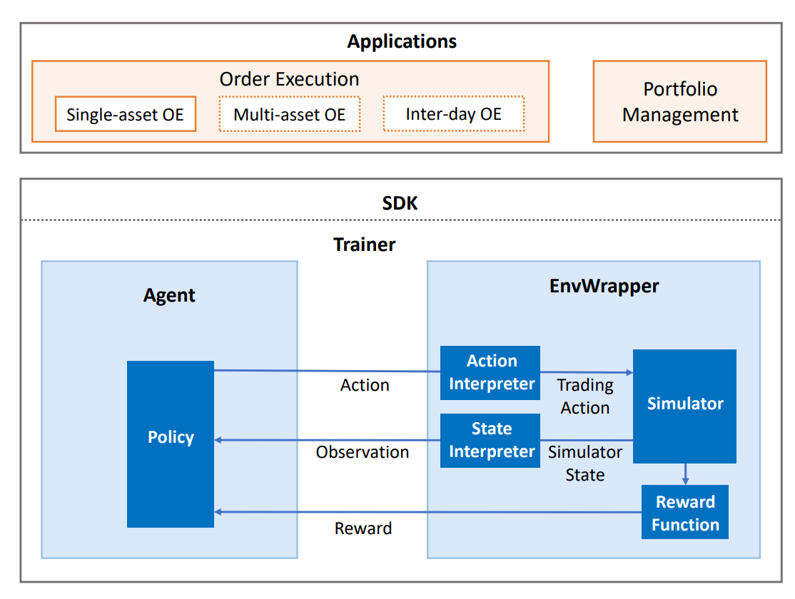

The Framework of QlibRL
=======================

QlibRL contains a full set of components that cover the entire lifecycle of an RL pipeline, including building the simulator of the market, shaping states & actions, training policies (strategies), and backtesting strategies in the simulated environment.

QlibRL is basically implemented with the support of Tianshou and Gym frameworks. The high-level structure of QlibRL is demonstrated below:

Here, we briefly introduce each component in the figure.

EnvWrapper
------------
EnvWrapper is the complete capsulation of the simulated environment. It receives actions from outside (policy/strategy/agent), simulates the changes in the market, and then replies rewards and updated states, thus forming an interaction loop.

In QlibRL, EnvWrapper is a subclass of gym.Env, so it implements all necessary interfaces of gym.Env. Any classes or pipelines that accept gym.Env should also accept EnvWrapper. Developers do not need to implement their own EnvWrapper to build their own environment. Instead, they only need to implement 4 components of the EnvWrapper:

- `Simulator`
    The simulator is the core component responsible for the environment simulation. Developers could implement all the logic that is directly related to the environment simulation in the Simulator in any way they like. In QlibRL, there are already two implementations of Simulator for single asset trading: 1) ``SingleAssetOrderExecution``, which is built based on Qlib's backtest toolkits and hence considers a lot of practical trading details but is slow. 2) ``SimpleSingleAssetOrderExecution``, which is built based on a simplified trading simulator, which ignores a lot of details (e.g. trading limitations, rounding) but is quite fast.
- `State interpreter` 
    The state interpreter is responsible for "interpret" states in the original format (format provided by the simulator) into states in a format that the policy could understand. For example, transform unstructured raw features into numerical tensors.
- `Action interpreter` 
    The action interpreter is similar to the state interpreter. But instead of states, it interprets actions generated by the policy, from the format provided by the policy to the format that is acceptable to the simulator.
- `Reward function` 
    The reward function returns a numerical reward to the policy after each time the policy takes an action. 

EnvWrapper will organically organize these components. Such decomposition allows for better flexibility in development. For example, if the developers want to train multiple types of policies in the same environment, they only need to design one simulator and design different state interpreters/action interpreters/reward functions for different types of policies.

QlibRL has well-defined base classes for all these 4 components. All the developers need to do is define their own components by inheriting the base classes and then implementing all interfaces required by the base classes. The API for the above base components can be found `here <../../reference/api.html#module-qlib.rl>`__.

Policy
------------
QlibRL directly uses Tianshou's policy. Developers could use policies provided by Tianshou off the shelf, or implement their own policies by inheriting Tianshou's policies.

Training Vessel & Trainer
-------------------------
As stated by their names, training vessels and trainers are helper classes used in training. A training vessel is a ship that contains a simulator/interpreters/reward function/policy, and it controls algorithm-related parts of training. Correspondingly, the trainer is responsible for controlling the runtime parts of training.

As you may have noticed, a training vessel itself holds all the required components to build an EnvWrapper rather than holding an instance of EnvWrapper directly. This allows the training vessel to create duplicates of EnvWrapper dynamically when necessary (for example, under parallel training).

With a training vessel, the trainer could finally launch the training pipeline by simple, Scikit-learn-like interfaces (i.e., ``trainer.fit()``).

The API for Trainer and TrainingVessel and can be found `here <../../reference/api.html#module-qlib.rl.trainer>`__.