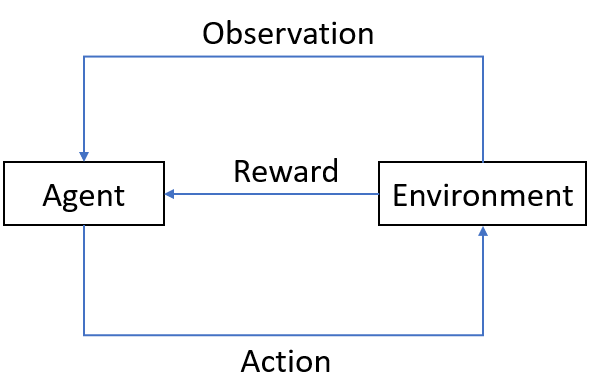

=====================================================
Reinforcement Learning in Quantitative Trading
=====================================================

Reinforcement Learning
======================
Different from supervised learning tasks such as classification tasks and regression tasks. Another important paradigm in machine learning is Reinforcement Learning(RL), 
which attempts to optimize an accumulative numerical reward signal by directly interacting with the environment under a few assumptions such as Markov Decision Process(MDP).

As demonstrated in the following figure, an RL system consists of four elements, 1)the agent 2) the environment the agent interacts with 3) the policy that the agent follows to take actions on the environment and 4)the reward signal from the environment to the agent. 
In general, the agent can perceive and interpret its environment, take actions and learn through reward, to seek long-term and maximum overall reward to achieve an optimal solution.

RL attempts to learn to produce actions by trial and error. 
By sampling actions and then observing which one leads to our desired outcome, a policy is obtained to generate optimal actions. 
In contrast to supervised learning, RL learns this not from a label but from a time-delayed label called a reward. 
This scalar value lets us know whether the current outcome is good or bad. 
In a word, the target of RL is to take actions to maximize reward.

The Qlib Reinforcement Learning toolkit (QlibRL) is an RL platform for quantitative investment, which provides support to implement the RL algorithms in Qlib.

Potential Application Scenarios in Quantitative Trading
=======================================================
RL methods have demonstrated remarkable achievements in various applications, including game playing, resource allocation, recommendation systems, marketing, and advertising.
In the context of investment, which involves continuous decision-making, let's consider the example of the stock market. Investors strive to optimize their investment returns by effectively managing their positions and stock holdings through various buying and selling behaviors.
Furthermore, investors carefully evaluate market conditions and stock-specific information before making each buying or selling decision. From an investor's perspective, this process can be viewed as a continuous decision-making process driven by interactions with the market. RL algorithms offer a promising approach to tackle such challenges.
Here are several scenarios where RL holds potential for application in quantitative investment.

Order Execution
---------------
The order execution task is to execute orders efficiently while considering multiple factors, including optimal prices, minimizing trading costs, reducing market impact, maximizing order fullfill rates, and achieving execution within a specified time frame. RL can be applied to such tasks by incorporating these objectives into the reward function and action selection process. Specifically, the RL agent interacts with the market environment, observes the state from market information, and makes decisions on next step execution. The RL algorithm learns an optimal execution strategy through trial and error, aiming to maximize the expected cumulative reward, which incorporates the desired objectives.

 - General Setting
    - Environment: The environment represents the financial market where order execution takes place. It encompasses variables such as the order book dynamics, liquidity, price movements, and market conditions.

    - State: The state refers to the information available to the RL agent at a given time step. It typically includes features such as the current order book state (bid-ask spread, order depth), historical price data, historical trading volume, market volatility, and any other relevant information that can aid in decision-making.

    - Action: The action is the decision made by the RL agent based on the observed state. In order execution, actions can include selecting the order size, price, and timing of execution.

    - Reward: The reward is a scalar signal that indicates the performance of the RL agent's action in the environment. The reward function is designed to encourage actions that lead to efficient and cost-effective order execution. It typically considers multiple objectives, such as maximizing price advantages, minimizing trading costs (including transaction fees and slippage), reducing market impact (the effect of the order on the market price) and maximizing order fullfill rates. 

 - Scenarios
    - Single-asset order execution: Single-asset order execution focuses on the task of executing a single order for a specific asset, such as a stock or a cryptocurrency. The primary objective is to execute the order efficiently while considering factors such as maximizing price advantages, minimizing trading costs, reducing market impact, and achieving a high fullfill rate. The RL agent interacts with the market environment and makes decisions on order size, price, and timing of execution for that particular asset. The goal is to learn an optimal execution strategy for the single asset, maximizing the expected cumulative reward while considering the specific dynamics and characteristics of that asset.

    - Multi-asset order execution: Multi-asset order execution expands the order execution task to involve multiple assets or securities. It typically involves executing a portfolio of orders across different assets simultaneously or sequentially. Unlike single-asset order execution, the focus is not only on the execution of individual orders but also on managing the interactions and dependencies between different assets within the portfolio. The RL agent needs to make decisions on the order sizes, prices, and timings for each asset in the portfolio, considering their interdependencies, cash constraints, market conditions, and transaction costs. The goal is to learn an optimal execution strategy that balances the execution efficiency for each asset while considering the overall performance and objectives of the portfolio as a whole.
   
The choice of settings and RL algorithm depends on the specific requirements of the task, available data, and desired performance objectives. 

Portfolio Construction
----------------------
Portfolio construction is a process of selecting and allocating assets in an investment portfolio. RL provides a framework to optimize portfolio management decisions by learning from interactions with the market environment and maximizing long-term returns while considering risk management.
 - General Setting
    - State: The state represents the current information about the market and the portfolio. It typically includes historical prices and volumes, technical indicators, and other relevant data.

    - Action: The action corresponds to the decision of allocating capital to different assets in the portfolio. It determines the weights or proportions of investments in each asset.

    - Reward: The reward is a metric that evaluates the performance of the portfolio. It can be defined in various ways, such as total return, risk-adjusted return, or other objectives like maximizing Sharpe ratio or minimizing drawdown.

 - Scenarios
    - Stock market: RL can be used to construct portfolios of stocks, where the agent learns to allocate capital among different stocks.

    - Cryptocurrency market: RL can be applied to construct portfolios of cryptocurrencies, where the agent learns to make allocation decisions.

    - Foreign exchange (Forex) market: RL can be used to construct portfolios of currency pairs, where the agent learns to allocate capital across different currencies based on exchange rate data, economic indicators, and other factors.

Similarly, the choice of basic setting and algorithm depends on the specific requirements of the problem and the characteristics of the market.