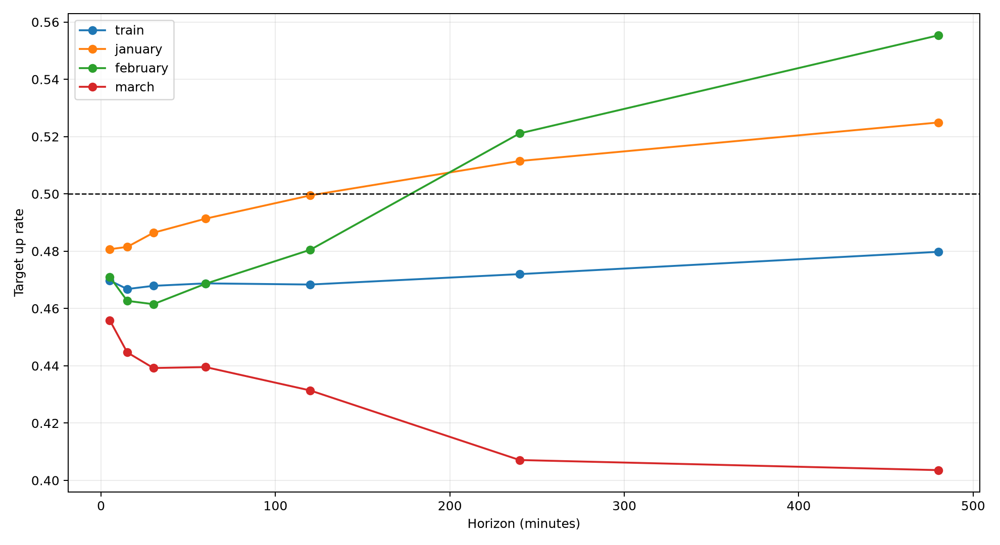
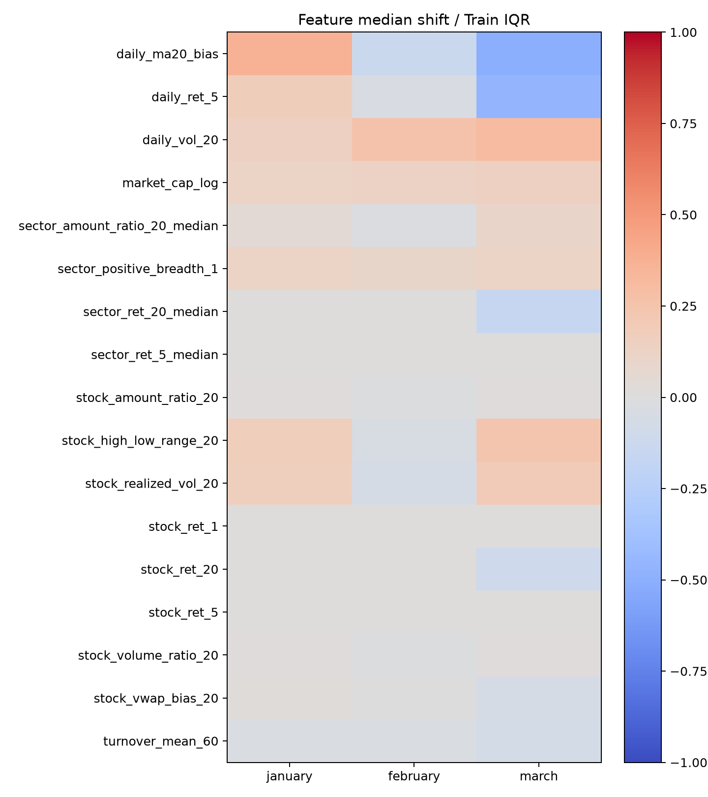
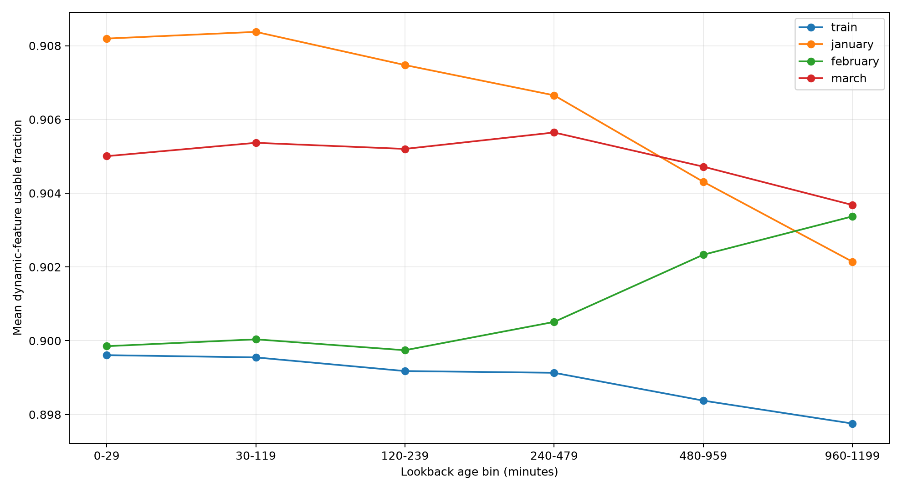

# Courage Strict Continuous V1 March漂移诊断闭环

## 结论

- 本报告使用原V1冻结step2250及既有January—March预测，不重新训练、不重新选checkpoint。
- March各horizon真实上涨率范围为`40.4%`—`45.7%`，多数方向基线因此升至约`54.3%`—`59.6%`。
- March模型prediction up rate范围为`2.1%`—`69.9%`；绝对方向与当月Label基准明显错位。
- 240/480m仍保留正Rank IC，但这与绝对收益均值和方向失配同时存在，支持“相对排序尚存、绝对条件均值漂移”的判断。
- 动态lookback平均可用率Train/January/February/March分别为`89.9%`/`90.6%`/`90.1%`/`90.5%`；名义1200分钟窗口并未因大面积缺失而整体失效。
- 当前模型仍保持`FAIL_BASELINE_GATE`；本诊断不授权April或新训练。

## March逐horizon汇总

| H | Target up | Pred up | ACC | Majority | ACC excess | BAcc | MCC | AUC | Rank IC | Bias |
|---:|---:|---:|---:|---:|---:|---:|---:|---:|---:|---:|
| 5 | 45.7% | 2.1% | 54.2% | 54.3% | -0.1% | 50.1% | +0.0074 | 50.2% | +0.0214 | -0.002% |
| 15 | 44.5% | 4.4% | 54.9% | 55.5% | -0.5% | 49.9% | -0.0026 | 49.6% | +0.0297 | +0.011% |
| 30 | 44.0% | 17.4% | 54.2% | 56.0% | -1.8% | 50.3% | +0.0078 | 50.0% | +0.0363 | +0.042% |
| 60 | 44.0% | 31.9% | 52.0% | 56.0% | -4.0% | 49.8% | -0.0042 | 50.4% | +0.0454 | +0.105% |
| 120 | 43.1% | 56.5% | 49.7% | 56.9% | -7.2% | 50.6% | +0.0111 | 51.9% | +0.0490 | +0.278% |
| 240 | 40.7% | 58.2% | 50.7% | 59.3% | -8.6% | 52.3% | +0.0455 | 54.6% | +0.0703 | +0.562% |
| 480 | 40.4% | 69.9% | 48.8% | 59.6% | -10.9% | 52.7% | +0.0577 | 56.8% | +0.0748 | +1.076% |

## March逐日摘要

| H | Days | Mean target up | Mean pred up | Mean BAcc | Mean MCC | Mean daily Rank IC |
|---:|---:|---:|---:|---:|---:|---:|
| 5 | 21 | 45.7% | 2.1% | 50.0% | +0.0008 | +0.0214 |
| 15 | 21 | 44.5% | 4.4% | 50.0% | +0.0046 | +0.0297 |
| 30 | 21 | 44.0% | 17.1% | 50.4% | +0.0110 | +0.0363 |
| 60 | 21 | 44.0% | 31.7% | 50.5% | +0.0131 | +0.0454 |
| 120 | 21 | 43.1% | 56.3% | 50.9% | +0.0200 | +0.0490 |
| 240 | 21 | 40.7% | 58.1% | 51.7% | +0.0322 | +0.0703 |
| 480 | 20 | 40.3% | 69.8% | 50.6% | +0.0213 | +0.0748 |

## 特征漂移最大的5项

| Feature | Missing Δ | Median shift/Train IQR | IQR ratio | PSI | Quantile-W1 |
|:--|---:|---:|---:|---:|---:|
| daily_ma20_bias | -0.16% | -0.506 | 1.259 | 0.405 | 0.0324102 |
| daily_ret_5 | -0.09% | -0.460 | 1.316 | 0.324 | 0.0275168 |
| daily_vol_20 | -0.17% | +0.309 | 0.997 | 0.236 | 0.00425194 |
| sector_ret_20_median | +0.04% | -0.149 | 1.550 | 0.170 | 0.00120314 |
| sector_ret_5_median | +0.03% | +0.000 | 2.075 | 0.139 | 0.000499987 |

## 分组与lookback产物

- March分组表包含`1050`行，覆盖30分钟位置桶、行业和四个换手率档。
- Lookback对每个时期固定系统抽样`200,000`条序列，并完整扫描每条序列的1200分钟历史。
- 各时期动态Feature的平均p95末端连续缺失长度为：Train `9.8`、January `9.1`、February `9.5`、March `9.5`分钟。
- `march_grouped_metrics.csv`保留所有满足最小样本数的组，不根据结果筛选。

## 解释边界

- PSI和quantile-W1是描述性漂移量，不是因果检验或新模型选择门。
- 行业分组为PIT行业身份；换手率为信号时点可见的T-1慢变量。
- Lookback采用固定系统样本控制高度重叠窗口的重复计数，但每条入样序列覆盖完整1200分钟。
- 未读取2026-04-01及以后数据；未执行训练、refit、策略、回测、交易或远端推送。
