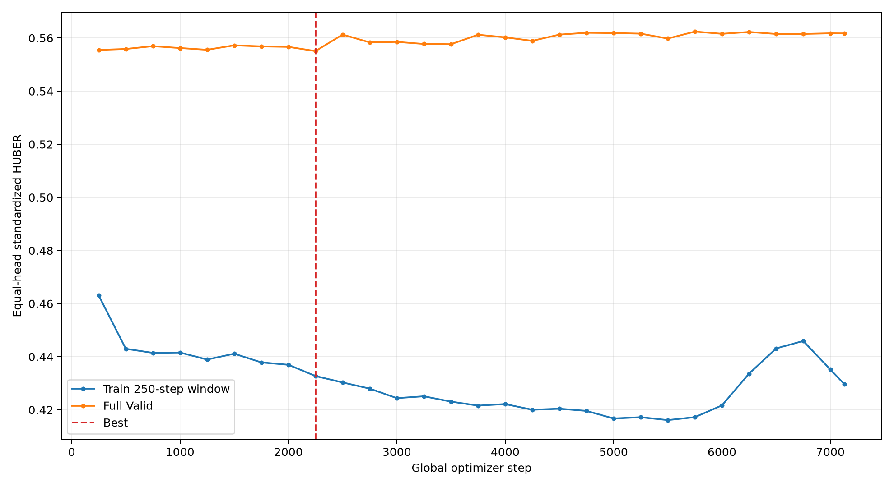
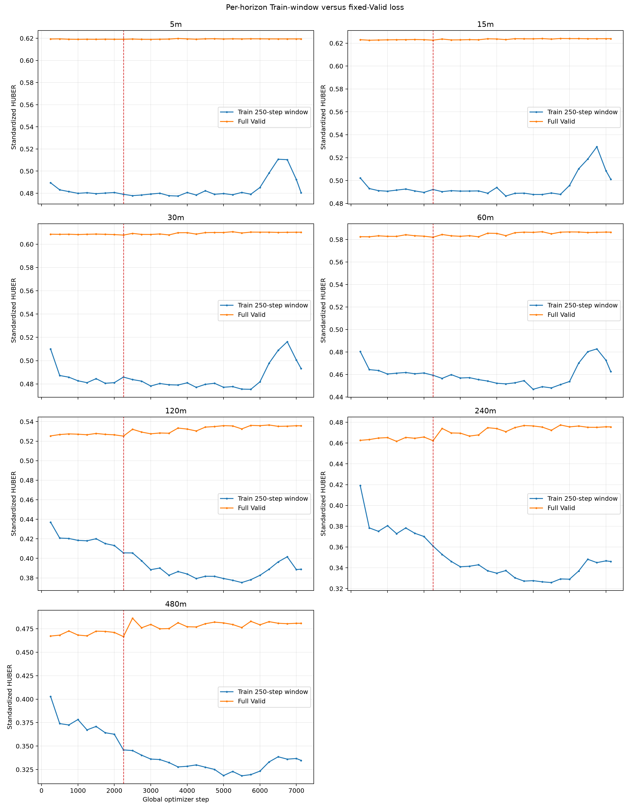
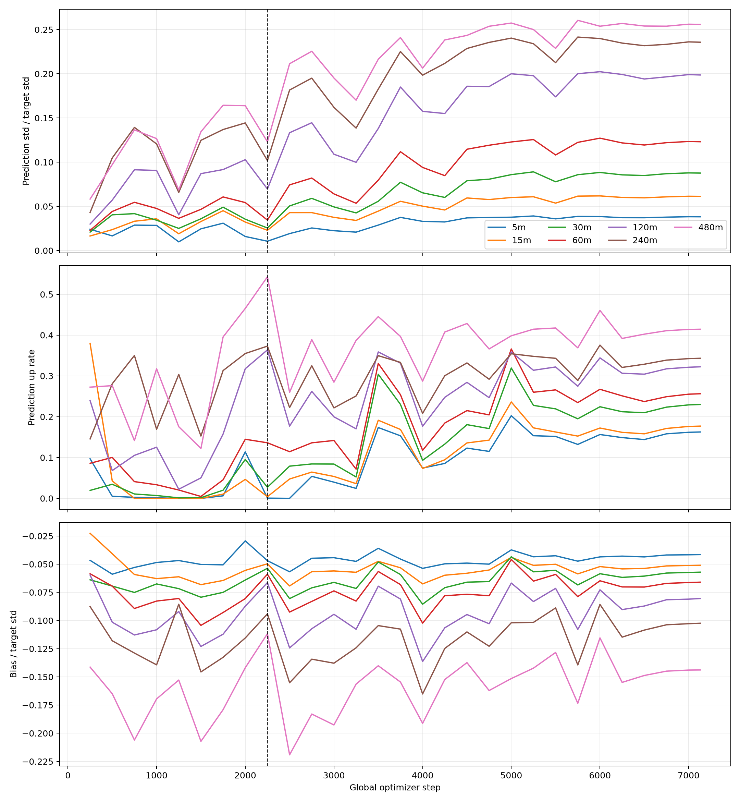

# Courage Strict Continuous V1 Diagnostic 复训报告

## 结论

- 原V1人口和参数复训完成：Train `7,301,712`、Valid `1,034,064`、`7131` steps；最佳仍为 step `2250`。
- 最佳Valid Huber `0.555099286`；原V1为 `0.555139156`，差值 `-0.000039870`。
- 完整基线门：`FAIL_BASELINE_GATE`；平均RMSE skill `-0.178%`，正skill `0/7`。
- 逐step日志确认输出收缩在训练早期已经形成；它不是最终checkpoint事后统计造成的假象。
- 按预注册门禁停止，不训练Origin-2/3，不读取April或更晚数据。

## Train / Valid loss

## 逐horizon Train / Valid loss

## Prediction动态诊断

下表均为完整固定January Valid的原始收益尺度统计。`Std ratio`越接近0，输出越接近常数。

| H | Target up | Step250 std/up/bias | Step2250 std/up/bias | Step7131 std/up/bias |
|---:|---:|---:|---:|---:|
| 5 | 48.1% | 0.024 / 9.7% / -0.020% | 0.011 / 0.1% / -0.020% | 0.038 / 16.3% / -0.018% |
| 15 | 48.1% | 0.016 / 38.0% / -0.017% | 0.023 / 0.4% / -0.038% | 0.061 / 17.7% / -0.039% |
| 30 | 48.7% | 0.021 / 2.0% / -0.068% | 0.026 / 2.7% / -0.057% | 0.088 / 23.0% / -0.061% |
| 60 | 49.1% | 0.023 / 8.6% / -0.087% | 0.034 / 13.6% / -0.088% | 0.123 / 25.6% / -0.098% |
| 120 | 49.9% | 0.030 / 24.0% / -0.123% | 0.070 / 36.4% / -0.136% | 0.199 / 32.2% / -0.165% |
| 240 | 51.2% | 0.043 / 14.6% / -0.249% | 0.102 / 37.3% / -0.268% | 0.236 / 34.3% / -0.291% |
| 480 | 52.5% | 0.058 / 27.3% / -0.594% | 0.123 / 54.3% / -0.469% | 0.256 / 41.4% / -0.604% |

## 解释

- 5m/15m很快退化为近乎永远预测下跌；最佳step时上涨率仅约0.1%/0.4%。
- 30m—120m虽然保留少量方向变化，但prediction std仍远低于target std。
- 240m/480m具有更高AUC和Rank IC，但绝对收益RMSE仍输给zero/Train mean；排序信息不能替代条件均值校准。
- Train loss继续下降而Valid在step2250后不再刷新，说明继续增加epoch不是当前修复方向。

## 证据

- [完整基线、逐日和分组报告](BASELINE_CLOSURE_EVALUATION.md)
- [最佳checkpoint分组指标](BEST_CHECKPOINT_GROUPED_METRICS.csv)：`1,477`行，覆盖日期、分钟位置、PIT行业和换手率。
- [既有三项Sanity Check](../courage_strict_continuous_v1/SANITY_CHECK_REPORT.md)
- [既有10-seed shuffled-label复核](../courage_strict_continuous_v1/SANITY_NULL_DISTRIBUTION_REPORT.md)
- [既有January—March冻结迁移诊断](../courage_strict_continuous_v1/FROZEN_ORIGIN1_TEMPORAL_TRANSFER_EVALUATION.md)

## 边界

- 本次没有改变原V1 provider、PIT人口、Feature、Label、模型、loss、seed或优化参数。
- 新checkpoint仅属于diagnostic命名空间，不覆盖、不晋升原V1 checkpoint。
- 未读取2026-02-02及以后数据；未执行refit、策略、回测、交易或远端推送。
