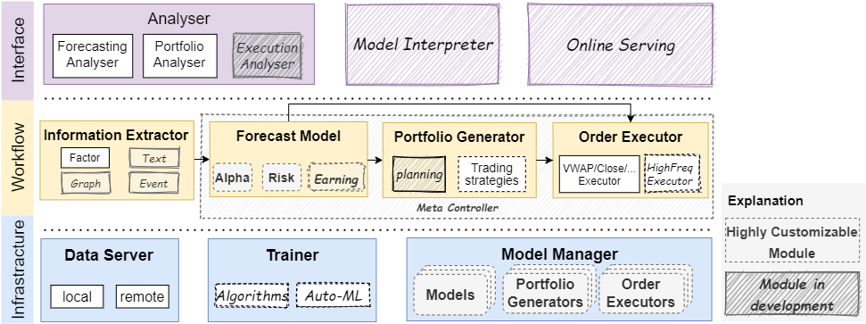

===============================
``Qlib``: Quantitative Platform
===============================

Introduction
===================

.. image:: ../_static/img/logo/white_bg_rec+word.png
    :align: center

``Qlib`` is an AI-oriented quantitative investment platform, which aims to realize the potential, empower the research, and create the value of AI technologies in quantitative investment.

With ``Qlib``, users can easily try their ideas to create better Quant investment strategies.

Framework
===================
   

At the module level, Qlib is a platform that consists of above components. The components are designed as loose-coupled modules and each component could be used stand-alone.

========================  ==============================================================================
Name                      Description
========================  ==============================================================================
`Infrastructure` layer    `Infrastructure` layer provides underlying support for Quant research.
                          `DataServer` provides high-performance infrastructure for users to manage 
                          and retrieve raw data. `Trainer` provides flexible interface to control
                          the training process of models which enable algorithms controlling the
                          training process.

`Workflow` layer          `Workflow` layer covers the whole workflow of quantitative investment.
                          `Information Extractor` extracts data for models. `Forecast Model` focuses
                          on producing all kinds of forecast signals (e.g. _alpha_, risk) for other
                          modules. With these signals `Portfolio Generator` will generate the target
                          portfolio and produce orders to be executed by `Order Executor`.

`Interface` layer         `Interface` layer tries to present a user-friendly interface for the underlying
                          system. `Analyser` module will provide users detailed analysis reports of
                          forecasting signals, portfolios and execution results
========================  ==============================================================================

- The modules with hand-drawn style are under development and will be released in the future.
- The modules with dashed borders are highly user-customizable and extendible.
