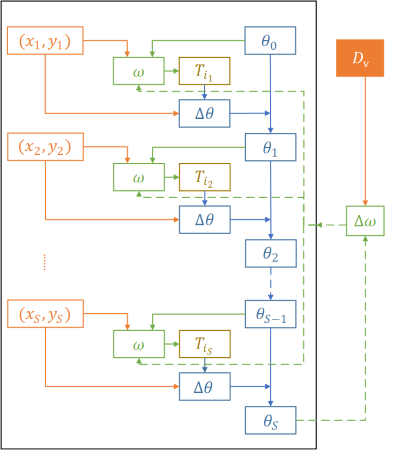

# Temporally Correlated Task Scheduling for Sequence Learning
### Background
Sequence learning has attracted much research attention from the machine learning community in recent years. In many applications, a sequence learning task is usually associated with multiple temporally correlated auxiliary tasks, which are different in terms of how much input information to use or which future step to predict. In stock trend forecasting, as demonstrated in Figure1, one can predict the price of a stock in different future days (e.g., tomorrow, the day after tomorrow). In this paper, we propose a framework to make use of those temporally correlated tasks to help each other. 

### Method
Given that there are usually multiple temporally correlated tasks, the key challenge lies in which tasks to use and when to use them in the training process. This work introduces a learnable task scheduler for sequence learning, which adaptively selects temporally correlated tasks during the training process. The scheduler accesses the model status and the current training data (e.g., in the current minibatch) and selects the best auxiliary task to help the training of the main task. The scheduler and the model for the main task are jointly trained through bi-level optimization: the scheduler is trained to maximize the validation performance of the model, and the model is trained to minimize the training loss guided by the scheduler. The process is demonstrated in Figure2.

 

At step , with training data , the scheduler  chooses a suitable task  (green solid lines) to update the model  (blue solid lines). After  steps, we evaluate the model  on the validation set and update the scheduler  (green dashed lines).

### Experiments
Due to different data versions and different Qlib versions, the original data and data preprocessing methods of the experimental settings in the paper are different from those experimental settings in the existing Qlib version. Therefore, we provide two versions of the code according to the two kinds of settings, 1) the [code](https://github.com/lwwang1995/tcts) that can be used to reproduce the experimental results and 2) the [code](https://github.com/microsoft/qlib/blob/main/qlib/contrib/model/pytorch_tcts.py) in the current Qlib baseline.

#### Setting1
* Dataset: We use the historical transaction data for 300 stocks on [CSI300](http://www.csindex.com.cn/en/indices/index-detail/000300) from 01/01/2008 to 08/01/2020. We split the data into training (01/01/2008-12/31/2013), validation (01/01/2014-12/31/2015), and test sets (01/01/2016-08/01/2020) based on the transaction time. 

* The main tasks  refers to forecasting return of stock  as following,

* Temporally correlated task sets , in this paper, ,  and  are used in , , and .

#### Setting2
* Dataset: We use the historical transaction data for 300 stocks on [CSI300](http://www.csindex.com.cn/en/indices/index-detail/000300) from 01/01/2008 to 08/01/2020. We split the data into training (01/01/2008-12/31/2014), validation (01/01/2015-12/31/2016), and test sets (01/01/2017-08/01/2020) based on the transaction time. 

* The main tasks  refers to forecasting return of stock  as following,

* In Qlib baseline, , is used in  .

### Experimental Result
You can find the experimental result of setting1 in the [paper](http://proceedings.mlr.press/v139/wu21e/wu21e.pdf) and the experimental result of setting2 in this [page](https://github.com/microsoft/qlib/tree/main/examples/benchmarks).