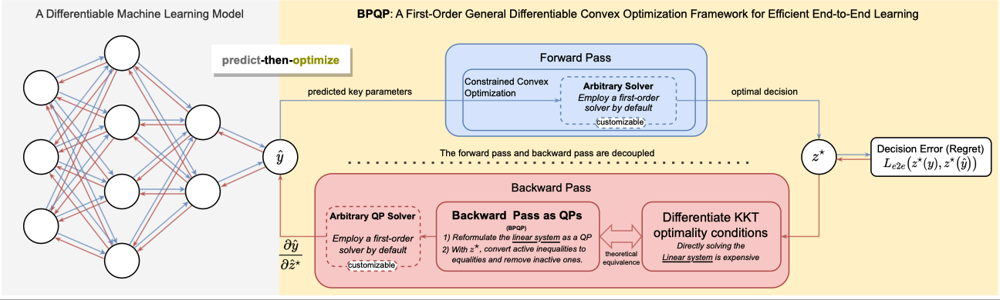
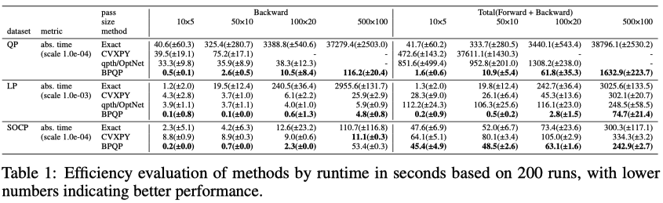

# BPQP
The implementation of the paper: "BPQP: A Differentiable Convex Optimization Framework for Efficient End-to-End Learning" [TODO: arXiv Hyperlink]

 

# Data & Environment
* Install python3.7, 3.8 or 3.9.
* Install Pytorch(1.12.0 in our experiment)
* Install the requirements in [requirements.txt](requirements.txt).
* Install the quantitative investment platform Qlib and download the data from Qlib:
```
# install Qlib from source
pip install --upgrade  cython
git clone https://github.com/microsoft/qlib.git && cd qlib
python setup.py install

# Download the stock features of Alpha158 from Qlib
python scripts/get_data.py qlib_data --target_dir ~/.qlib/qlib_data/cn_data --region cn --version v2 
```
* Run [dataset/papare_dataset.py](dataset/prepare_dataset.py) to generate train/valid/test dataset
```
python papare_dataset.py
```
# Reproduce our BPQP in large-scale QPs and LPs experiment

 

[Large scale QPs and LPs experiment.ipynb](Large scale QPs and LPs experiment.ipynb)

# Reproduce our BPQP for SOCP experiment

[SOCP_exp.ipynb](SOCP_exp.ipynb)

# Reproduce our BPQP for end-to-end portfolio optimization
```
python main.py --market CN --loss e2e --predictor mlp --solver bpqp
```

# Reproduce benchmark
* Two-Stage
```
python main.py --market CN --loss mse --predictor mlp --solver bpqp
```

* DC3
```
python main.py --market CN --loss e2e --predictor mlp --solver dc3  
```

# About the  analysis & results
The results in the paper are located in the directory [./analysis/](./analysis/). They are named after the corresponding table or figure name in the paper.

For example, if you want to obtain the results of Table 1.
- The dependent data is located in.  [./analysis/data/Table1/](./analysis/data/Table1/)
- The script for generating the results will be [./analysis/Table1.py](./analysis/Table1.py).

Similarly, for the rest.
